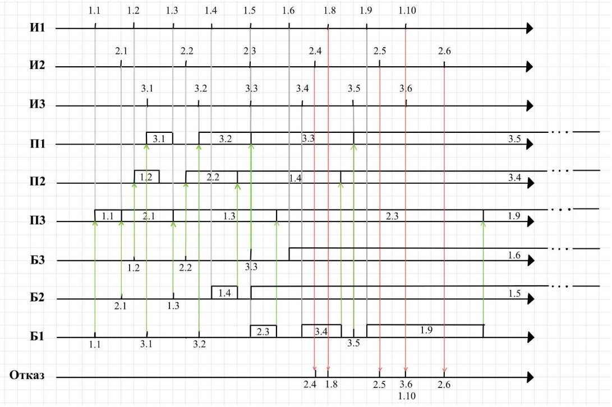

 
 <h1 align="center">CMO</h1>
 
<b>时序控制系统及自动目标测试</b>

## 分析
所有的文件都应该有一根时间线(TimeLine)来贯穿，同时请求(request)应作为事件(event)的最小单位，**CMO 系统中的所有事务都应该是对于请求而言**

**需要一下的功能模块：**
 - 时间线（TimeLine）
 - 请求（Request）
 - 源（Source）
 - 缓冲区（Buffer）
 - 处理机（Device）

---

**各模块类型的简要概述：**

原文：
 - ИБ - бесконечный (источники)
 - ИЗ2 - равномерный (законы распределения)
 - ПЗ1 – экспоненциальный (законы распределения времени прибор)
 - Д10З3 - на свободное место (записи в буфер, если есть место)
 - Д10О5 – вновь пришедшая (дисциплины отказа)
 - Д2П1 - приоритет по номеру прибора (выбор прибора)
 - Д2Б4 - приоритет по номеру источника, по одной заявке (выбор заявки из буфера)
 - ОД1 - календарь событий, буфер и текущее состояние (отображение динамики функционирования модели)
 - ОР1 - сводная таблица результатов (отображение результатов)

---

中文：
 - ИБ：源的类型为无限源（一直生成请求）
 - ИЗ2：每个源生成请求的间隔为**等长**的
 - ПЗ1：对于每个处理机处理请求的时长为**负指数增长**
 - Д10З3：对于请求插入缓冲区的规则为，按照顺序选择缓冲区,插入空闲的缓冲区。不存在转移队列
 - Д10О5：如果没有空闲的处理机及缓冲区，请求应直接离开系统，并且不得改变缓冲区的任何状态
 - Д2П1：处理机的优先级和源的优先级都由其编号决定，选择**优先级最大的处理机**进行处理请求
 - Д2Б4：从缓冲区中选择请求的规则为，选择**优先级最高**的请求（请求的优先级就是源的编号），如果缓冲区中有多个同优先级的请求，优先选择最后进入缓冲区的
 - ОД1：手动测试模式，输出日志、缓冲区及当前的事件
 - ОР1：自动测试模式，输出测试结果

---

## 架构

## 模拟时序图

## 程序框图

<div class="mxgraph" style="max-width:100%;border:1px solid transparent;" data-mxgraph="{&quot;highlight&quot;:&quot;#0000ff&quot;,&quot;nav&quot;:true,&quot;resize&quot;:true,&quot;toolbar&quot;:&quot;zoom layers lightbox&quot;,&quot;edit&quot;:&quot;_blank&quot;,&quot;xml&quot;:&quot;&lt;mxfile host=\&quot;drawio-plugin\&quot; modified=\&quot;2021-11-25T11:21:40.773Z\&quot; agent=\&quot;5.0 (Windows NT 6.2; Win64; x64) AppleWebKit/537.36 (KHTML, like Gecko) Chrome/89.0.4389.114 Safari/537.36\&quot; etag=\&quot;npuhdiorUIzTzuBijz5K\&quot; version=\&quot;14.7.4\&quot; type=\&quot;embed\&quot;&gt;&lt;diagram id=\&quot;AH1xkY92VXm6v2RYYMqo\&quot; name=\&quot;Page-1\&quot;&gt;&lt;mxGraphModel dx=\&quot;1681\&quot; dy=\&quot;1100\&quot; grid=\&quot;1\&quot; gridSize=\&quot;10\&quot; guides=\&quot;1\&quot; tooltips=\&quot;1\&quot; connect=\&quot;1\&quot; arrows=\&quot;1\&quot; fold=\&quot;1\&quot; page=\&quot;1\&quot; pageScale=\&quot;1\&quot; pageWidth=\&quot;850\&quot; pageHeight=\&quot;1100\&quot; math=\&quot;0\&quot; shadow=\&quot;0\&quot;&gt;&lt;root&gt;&lt;mxCell id=\&quot;0\&quot;/&gt;&lt;mxCell id=\&quot;1\&quot; parent=\&quot;0\&quot;/&gt;&lt;mxCell id=\&quot;57\&quot; value=\&quot;&amp;lt;font style=&amp;quot;font-size: 13px&amp;quot;&amp;gt;&amp;lt;font color=&amp;quot;#cc00cc&amp;quot;&amp;gt;БМС3&amp;lt;br&amp;gt;&amp;lt;br&amp;gt;&amp;lt;br&amp;gt;&amp;lt;br&amp;gt;&amp;lt;/font&amp;gt;&amp;lt;br&amp;gt;&amp;lt;/font&amp;gt;\&quot; style=\&quot;rounded=1;whiteSpace=wrap;html=1;fillColor=none;dashed=1;align=left;strokeColor=#CC00CC;\&quot; parent=\&quot;1\&quot; vertex=\&quot;1\&quot;&gt;&lt;mxGeometry x=\&quot;750\&quot; y=\&quot;276.5\&quot; width=\&quot;130\&quot; height=\&quot;82.5\&quot; as=\&quot;geometry\&quot;/&gt;&lt;/mxCell&gt;&lt;mxCell id=\&quot;56\&quot; value=\&quot;&amp;lt;div&amp;gt;&amp;lt;span style=&amp;quot;font-size: 14px&amp;quot;&amp;gt;&amp;lt;font color=&amp;quot;#cccc00&amp;quot;&amp;gt;&amp;amp;nbsp;БМС2&amp;lt;/font&amp;gt;&amp;lt;/span&amp;gt;&amp;lt;/div&amp;gt;&amp;lt;font&amp;gt;&amp;lt;div&amp;gt;&amp;lt;span style=&amp;quot;font-size: 14px&amp;quot;&amp;gt;&amp;lt;font color=&amp;quot;#cccc00&amp;quot;&amp;gt;&amp;lt;br&amp;gt;&amp;lt;/font&amp;gt;&amp;lt;/span&amp;gt;&amp;lt;/div&amp;gt;&amp;lt;div&amp;gt;&amp;lt;span style=&amp;quot;font-size: 14px&amp;quot;&amp;gt;&amp;lt;font color=&amp;quot;#cccc00&amp;quot;&amp;gt;&amp;lt;br&amp;gt;&amp;lt;/font&amp;gt;&amp;lt;/span&amp;gt;&amp;lt;/div&amp;gt;&amp;lt;div&amp;gt;&amp;lt;font color=&amp;quot;#cccc00&amp;quot;&amp;gt;&amp;lt;br&amp;gt;&amp;lt;/font&amp;gt;&amp;lt;/div&amp;gt;&amp;lt;div&amp;gt;&amp;lt;font color=&amp;quot;#cccc00&amp;quot;&amp;gt;&amp;lt;br&amp;gt;&amp;lt;/font&amp;gt;&amp;lt;/div&amp;gt;&amp;lt;div&amp;gt;&amp;lt;br&amp;gt;&amp;lt;/div&amp;gt;&amp;lt;/font&amp;gt;\&quot; style=\&quot;rounded=1;whiteSpace=wrap;html=1;fillColor=none;dashed=1;align=right;shadow=0;strokeColor=#CCCC00;\&quot; parent=\&quot;1\&quot; vertex=\&quot;1\&quot;&gt;&lt;mxGeometry x=\&quot;602\&quot; y=\&quot;375\&quot; width=\&quot;268\&quot; height=\&quot;350.5\&quot; as=\&quot;geometry\&quot;/&gt;&lt;/mxCell&gt;&lt;mxCell id=\&quot;55\&quot; value=\&quot;&amp;lt;font style=&amp;quot;font-size: 14px&amp;quot;&amp;gt;&amp;lt;font color=&amp;quot;#007fff&amp;quot; style=&amp;quot;font-size: 14px&amp;quot;&amp;gt;&amp;amp;nbsp;БМС1&amp;lt;br&amp;gt;&amp;lt;br&amp;gt;&amp;lt;br&amp;gt;&amp;lt;br&amp;gt;&amp;lt;br&amp;gt;&amp;lt;/font&amp;gt;&amp;lt;br&amp;gt;&amp;lt;/font&amp;gt;\&quot; style=\&quot;rounded=1;whiteSpace=wrap;html=1;fillColor=none;dashed=1;align=left;shadow=0;strokeColor=#007FFF;\&quot; parent=\&quot;1\&quot; vertex=\&quot;1\&quot;&gt;&lt;mxGeometry x=\&quot;30\&quot; y=\&quot;370\&quot; width=\&quot;558\&quot; height=\&quot;487.5\&quot; as=\&quot;geometry\&quot;/&gt;&lt;/mxCell&gt;&lt;mxCell id=\&quot;21\&quot; style=\&quot;edgeStyle=orthogonalEdgeStyle;rounded=0;orthogonalLoop=1;jettySize=auto;html=1;exitX=0.5;exitY=1;exitDx=0;exitDy=0;entryX=0.5;entryY=0;entryDx=0;entryDy=0;\&quot; parent=\&quot;1\&quot; source=\&quot;2\&quot; target=\&quot;4\&quot; edge=\&quot;1\&quot;&gt;&lt;mxGeometry relative=\&quot;1\&quot; as=\&quot;geometry\&quot;/&gt;&lt;/mxCell&gt;&lt;mxCell id=\&quot;2\&quot; value=\&quot;Начало\&quot; style=\&quot;ellipse;whiteSpace=wrap;html=1;\&quot; parent=\&quot;1\&quot; vertex=\&quot;1\&quot;&gt;&lt;mxGeometry x=\&quot;227\&quot; y=\&quot;40\&quot; width=\&quot;110\&quot; height=\&quot;40\&quot; as=\&quot;geometry\&quot;/&gt;&lt;/mxCell&gt;&lt;mxCell id=\&quot;3\&quot; value=\&quot;Конец\&quot; style=\&quot;ellipse;whiteSpace=wrap;html=1;\&quot; parent=\&quot;1\&quot; vertex=\&quot;1\&quot;&gt;&lt;mxGeometry x=\&quot;760\&quot; y=\&quot;300\&quot; width=\&quot;110\&quot; height=\&quot;40\&quot; as=\&quot;geometry\&quot;/&gt;&lt;/mxCell&gt;&lt;mxCell id=\&quot;22\&quot; style=\&quot;edgeStyle=orthogonalEdgeStyle;rounded=0;orthogonalLoop=1;jettySize=auto;html=1;exitX=0.5;exitY=1;exitDx=0;exitDy=0;entryX=0.5;entryY=0;entryDx=0;entryDy=0;\&quot; parent=\&quot;1\&quot; source=\&quot;4\&quot; target=\&quot;6\&quot; edge=\&quot;1\&quot;&gt;&lt;mxGeometry relative=\&quot;1\&quot; as=\&quot;geometry\&quot;/&gt;&lt;/mxCell&gt;&lt;mxCell id=\&quot;4\&quot; value=\&quot;Начальные присвоения\&quot; style=\&quot;rounded=0;whiteSpace=wrap;html=1;\&quot; parent=\&quot;1\&quot; vertex=\&quot;1\&quot;&gt;&lt;mxGeometry x=\&quot;222\&quot; y=\&quot;100\&quot; width=\&quot;120\&quot; height=\&quot;40\&quot; as=\&quot;geometry\&quot;/&gt;&lt;/mxCell&gt;&lt;mxCell id=\&quot;25\&quot; style=\&quot;edgeStyle=orthogonalEdgeStyle;rounded=0;orthogonalLoop=1;jettySize=auto;html=1;\&quot; parent=\&quot;1\&quot; source=\&quot;5\&quot; target=\&quot;7\&quot; edge=\&quot;1\&quot;&gt;&lt;mxGeometry relative=\&quot;1\&quot; as=\&quot;geometry\&quot;/&gt;&lt;/mxCell&gt;&lt;mxCell id=\&quot;37\&quot; style=\&quot;edgeStyle=orthogonalEdgeStyle;rounded=0;orthogonalLoop=1;jettySize=auto;html=1;exitX=1;exitY=0.5;exitDx=0;exitDy=0;entryX=0;entryY=0.5;entryDx=0;entryDy=0;\&quot; parent=\&quot;1\&quot; source=\&quot;5\&quot; target=\&quot;35\&quot; edge=\&quot;1\&quot;&gt;&lt;mxGeometry relative=\&quot;1\&quot; as=\&quot;geometry\&quot;/&gt;&lt;/mxCell&gt;&lt;mxCell id=\&quot;5\&quot; value=\&quot;ОС&amp;lt;br&amp;gt;поступление&amp;lt;br&amp;gt;заявки\&quot; style=\&quot;rhombus;whiteSpace=wrap;html=1;\&quot; parent=\&quot;1\&quot; vertex=\&quot;1\&quot;&gt;&lt;mxGeometry x=\&quot;222\&quot; y=\&quot;280\&quot; width=\&quot;120\&quot; height=\&quot;80\&quot; as=\&quot;geometry\&quot;/&gt;&lt;/mxCell&gt;&lt;mxCell id=\&quot;24\&quot; style=\&quot;edgeStyle=orthogonalEdgeStyle;rounded=0;orthogonalLoop=1;jettySize=auto;html=1;exitX=0.5;exitY=1;exitDx=0;exitDy=0;entryX=0.5;entryY=0;entryDx=0;entryDy=0;\&quot; parent=\&quot;1\&quot; source=\&quot;6\&quot; target=\&quot;5\&quot; edge=\&quot;1\&quot;&gt;&lt;mxGeometry relative=\&quot;1\&quot; as=\&quot;geometry\&quot;/&gt;&lt;/mxCell&gt;&lt;mxCell id=\&quot;6\&quot; value=\&quot;Выбирается ОС с приоритетом 0 и минимальным Тос\&quot; style=\&quot;rounded=0;whiteSpace=wrap;html=1;\&quot; parent=\&quot;1\&quot; vertex=\&quot;1\&quot;&gt;&lt;mxGeometry x=\&quot;222\&quot; y=\&quot;180\&quot; width=\&quot;120\&quot; height=\&quot;60\&quot; as=\&quot;geometry\&quot;/&gt;&lt;/mxCell&gt;&lt;mxCell id=\&quot;26\&quot; style=\&quot;edgeStyle=orthogonalEdgeStyle;rounded=0;orthogonalLoop=1;jettySize=auto;html=1;exitX=0.5;exitY=1;exitDx=0;exitDy=0;entryX=0.5;entryY=0;entryDx=0;entryDy=0;\&quot; parent=\&quot;1\&quot; source=\&quot;7\&quot; target=\&quot;9\&quot; edge=\&quot;1\&quot;&gt;&lt;mxGeometry relative=\&quot;1\&quot; as=\&quot;geometry\&quot;/&gt;&lt;/mxCell&gt;&lt;mxCell id=\&quot;7\&quot; value=\&quot;Генерация следующей заявки\&quot; style=\&quot;rounded=0;whiteSpace=wrap;html=1;\&quot; parent=\&quot;1\&quot; vertex=\&quot;1\&quot;&gt;&lt;mxGeometry x=\&quot;67\&quot; y=\&quot;373\&quot; width=\&quot;120\&quot; height=\&quot;60\&quot; as=\&quot;geometry\&quot;/&gt;&lt;/mxCell&gt;&lt;mxCell id=\&quot;27\&quot; style=\&quot;edgeStyle=orthogonalEdgeStyle;rounded=0;orthogonalLoop=1;jettySize=auto;html=1;exitX=0.5;exitY=1;exitDx=0;exitDy=0;\&quot; parent=\&quot;1\&quot; source=\&quot;9\&quot; target=\&quot;11\&quot; edge=\&quot;1\&quot;&gt;&lt;mxGeometry relative=\&quot;1\&quot; as=\&quot;geometry\&quot;/&gt;&lt;/mxCell&gt;&lt;mxCell id=\&quot;32\&quot; style=\&quot;edgeStyle=orthogonalEdgeStyle;rounded=0;orthogonalLoop=1;jettySize=auto;html=1;exitX=1;exitY=0.5;exitDx=0;exitDy=0;entryX=0;entryY=0.5;entryDx=0;entryDy=0;\&quot; parent=\&quot;1\&quot; source=\&quot;9\&quot; target=\&quot;17\&quot; edge=\&quot;1\&quot;&gt;&lt;mxGeometry relative=\&quot;1\&quot; as=\&quot;geometry\&quot;/&gt;&lt;/mxCell&gt;&lt;mxCell id=\&quot;9\&quot; value=\&quot;Есть&amp;lt;br&amp;gt;свободный&amp;lt;br&amp;gt;прибор\&quot; style=\&quot;rhombus;whiteSpace=wrap;html=1;\&quot; parent=\&quot;1\&quot; vertex=\&quot;1\&quot;&gt;&lt;mxGeometry x=\&quot;67\&quot; y=\&quot;463\&quot; width=\&quot;120\&quot; height=\&quot;80\&quot; as=\&quot;geometry\&quot;/&gt;&lt;/mxCell&gt;&lt;mxCell id=\&quot;28\&quot; style=\&quot;edgeStyle=orthogonalEdgeStyle;rounded=0;orthogonalLoop=1;jettySize=auto;html=1;exitX=0.5;exitY=1;exitDx=0;exitDy=0;entryX=0.5;entryY=0;entryDx=0;entryDy=0;\&quot; parent=\&quot;1\&quot; source=\&quot;11\&quot; target=\&quot;12\&quot; edge=\&quot;1\&quot;&gt;&lt;mxGeometry relative=\&quot;1\&quot; as=\&quot;geometry\&quot;/&gt;&lt;/mxCell&gt;&lt;mxCell id=\&quot;29\&quot; style=\&quot;edgeStyle=orthogonalEdgeStyle;rounded=0;orthogonalLoop=1;jettySize=auto;html=1;exitX=1;exitY=0.5;exitDx=0;exitDy=0;\&quot; parent=\&quot;1\&quot; source=\&quot;11\&quot; target=\&quot;13\&quot; edge=\&quot;1\&quot;&gt;&lt;mxGeometry relative=\&quot;1\&quot; as=\&quot;geometry\&quot;/&gt;&lt;/mxCell&gt;&lt;mxCell id=\&quot;11\&quot; value=\&quot;Свободный&amp;lt;br&amp;gt;прибор = 1\&quot; style=\&quot;rhombus;whiteSpace=wrap;html=1;\&quot; parent=\&quot;1\&quot; vertex=\&quot;1\&quot;&gt;&lt;mxGeometry x=\&quot;67\&quot; y=\&quot;563\&quot; width=\&quot;120\&quot; height=\&quot;80\&quot; as=\&quot;geometry\&quot;/&gt;&lt;/mxCell&gt;&lt;mxCell id=\&quot;30\&quot; style=\&quot;edgeStyle=orthogonalEdgeStyle;rounded=0;orthogonalLoop=1;jettySize=auto;html=1;exitX=0.5;exitY=1;exitDx=0;exitDy=0;\&quot; parent=\&quot;1\&quot; source=\&quot;12\&quot; target=\&quot;15\&quot; edge=\&quot;1\&quot;&gt;&lt;mxGeometry relative=\&quot;1\&quot; as=\&quot;geometry\&quot;/&gt;&lt;/mxCell&gt;&lt;mxCell id=\&quot;12\&quot; value=\&quot;Выберить прибор с наивысшим приоритетом\&quot; style=\&quot;rounded=0;whiteSpace=wrap;html=1;\&quot; parent=\&quot;1\&quot; vertex=\&quot;1\&quot;&gt;&lt;mxGeometry x=\&quot;67\&quot; y=\&quot;673\&quot; width=\&quot;120\&quot; height=\&quot;60\&quot; as=\&quot;geometry\&quot;/&gt;&lt;/mxCell&gt;&lt;mxCell id=\&quot;31\&quot; style=\&quot;edgeStyle=orthogonalEdgeStyle;rounded=0;orthogonalLoop=1;jettySize=auto;html=1;entryX=0.5;entryY=0;entryDx=0;entryDy=0;\&quot; parent=\&quot;1\&quot; source=\&quot;13\&quot; target=\&quot;15\&quot; edge=\&quot;1\&quot;&gt;&lt;mxGeometry relative=\&quot;1\&quot; as=\&quot;geometry\&quot;/&gt;&lt;/mxCell&gt;&lt;mxCell id=\&quot;13\&quot; value=\&quot;Выберить&amp;lt;br&amp;gt;единственный прибор\&quot; style=\&quot;rounded=0;whiteSpace=wrap;html=1;\&quot; parent=\&quot;1\&quot; vertex=\&quot;1\&quot;&gt;&lt;mxGeometry x=\&quot;208\&quot; y=\&quot;673\&quot; width=\&quot;120\&quot; height=\&quot;60\&quot; as=\&quot;geometry\&quot;/&gt;&lt;/mxCell&gt;&lt;mxCell id=\&quot;45\&quot; style=\&quot;edgeStyle=orthogonalEdgeStyle;rounded=0;orthogonalLoop=1;jettySize=auto;html=1;exitX=0.5;exitY=1;exitDx=0;exitDy=0;\&quot; parent=\&quot;1\&quot; source=\&quot;15\&quot; edge=\&quot;1\&quot;&gt;&lt;mxGeometry relative=\&quot;1\&quot; as=\&quot;geometry\&quot;&gt;&lt;mxPoint x=\&quot;197\&quot; y=\&quot;960\&quot; as=\&quot;targetPoint\&quot;/&gt;&lt;/mxGeometry&gt;&lt;/mxCell&gt;&lt;mxCell id=\&quot;15\&quot; value=\&quot;Заявка помещается на прибор\&quot; style=\&quot;rounded=0;whiteSpace=wrap;html=1;\&quot; parent=\&quot;1\&quot; vertex=\&quot;1\&quot;&gt;&lt;mxGeometry x=\&quot;137\&quot; y=\&quot;783\&quot; width=\&quot;120\&quot; height=\&quot;60\&quot; as=\&quot;geometry\&quot;/&gt;&lt;/mxCell&gt;&lt;mxCell id=\&quot;47\&quot; style=\&quot;edgeStyle=orthogonalEdgeStyle;rounded=0;orthogonalLoop=1;jettySize=auto;html=1;exitX=0.5;exitY=1;exitDx=0;exitDy=0;\&quot; parent=\&quot;1\&quot; source=\&quot;16\&quot; edge=\&quot;1\&quot;&gt;&lt;mxGeometry relative=\&quot;1\&quot; as=\&quot;geometry\&quot;&gt;&lt;mxPoint x=\&quot;361\&quot; y=\&quot;960\&quot; as=\&quot;targetPoint\&quot;/&gt;&lt;/mxGeometry&gt;&lt;/mxCell&gt;&lt;mxCell id=\&quot;16\&quot; value=\&quot;Отказ&amp;amp;nbsp;текущии заявки\&quot; style=\&quot;rounded=0;whiteSpace=wrap;html=1;\&quot; parent=\&quot;1\&quot; vertex=\&quot;1\&quot;&gt;&lt;mxGeometry x=\&quot;301\&quot; y=\&quot;573\&quot; width=\&quot;120\&quot; height=\&quot;60\&quot; as=\&quot;geometry\&quot;/&gt;&lt;/mxCell&gt;&lt;mxCell id=\&quot;33\&quot; style=\&quot;edgeStyle=orthogonalEdgeStyle;rounded=0;orthogonalLoop=1;jettySize=auto;html=1;exitX=0.5;exitY=1;exitDx=0;exitDy=0;entryX=0.5;entryY=0;entryDx=0;entryDy=0;\&quot; parent=\&quot;1\&quot; source=\&quot;17\&quot; target=\&quot;16\&quot; edge=\&quot;1\&quot;&gt;&lt;mxGeometry relative=\&quot;1\&quot; as=\&quot;geometry\&quot;/&gt;&lt;/mxCell&gt;&lt;mxCell id=\&quot;34\&quot; style=\&quot;edgeStyle=orthogonalEdgeStyle;rounded=0;orthogonalLoop=1;jettySize=auto;html=1;exitX=1;exitY=0.5;exitDx=0;exitDy=0;\&quot; parent=\&quot;1\&quot; source=\&quot;17\&quot; target=\&quot;18\&quot; edge=\&quot;1\&quot;&gt;&lt;mxGeometry relative=\&quot;1\&quot; as=\&quot;geometry\&quot;/&gt;&lt;/mxCell&gt;&lt;mxCell id=\&quot;17\&quot; value=\&quot;Буфер полон\&quot; style=\&quot;rhombus;whiteSpace=wrap;html=1;\&quot; parent=\&quot;1\&quot; vertex=\&quot;1\&quot;&gt;&lt;mxGeometry x=\&quot;301\&quot; y=\&quot;463\&quot; width=\&quot;120\&quot; height=\&quot;80\&quot; as=\&quot;geometry\&quot;/&gt;&lt;/mxCell&gt;&lt;mxCell id=\&quot;48\&quot; style=\&quot;edgeStyle=orthogonalEdgeStyle;rounded=0;orthogonalLoop=1;jettySize=auto;html=1;exitX=0.5;exitY=1;exitDx=0;exitDy=0;\&quot; parent=\&quot;1\&quot; source=\&quot;18\&quot; edge=\&quot;1\&quot;&gt;&lt;mxGeometry relative=\&quot;1\&quot; as=\&quot;geometry\&quot;&gt;&lt;mxPoint x=\&quot;521\&quot; y=\&quot;960\&quot; as=\&quot;targetPoint\&quot;/&gt;&lt;/mxGeometry&gt;&lt;/mxCell&gt;&lt;mxCell id=\&quot;18\&quot; value=\&quot;Помещение заявки в буфер\&quot; style=\&quot;rounded=0;whiteSpace=wrap;html=1;\&quot; parent=\&quot;1\&quot; vertex=\&quot;1\&quot;&gt;&lt;mxGeometry x=\&quot;461\&quot; y=\&quot;573\&quot; width=\&quot;120\&quot; height=\&quot;60\&quot; as=\&quot;geometry\&quot;/&gt;&lt;/mxCell&gt;&lt;mxCell id=\&quot;38\&quot; style=\&quot;edgeStyle=orthogonalEdgeStyle;rounded=0;orthogonalLoop=1;jettySize=auto;html=1;entryX=0.5;entryY=0;entryDx=0;entryDy=0;\&quot; parent=\&quot;1\&quot; source=\&quot;35\&quot; target=\&quot;36\&quot; edge=\&quot;1\&quot;&gt;&lt;mxGeometry relative=\&quot;1\&quot; as=\&quot;geometry\&quot;/&gt;&lt;/mxCell&gt;&lt;mxCell id=\&quot;39\&quot; style=\&quot;edgeStyle=orthogonalEdgeStyle;rounded=0;orthogonalLoop=1;jettySize=auto;html=1;exitX=1;exitY=0.5;exitDx=0;exitDy=0;entryX=0;entryY=0.5;entryDx=0;entryDy=0;\&quot; parent=\&quot;1\&quot; source=\&quot;35\&quot; target=\&quot;3\&quot; edge=\&quot;1\&quot;&gt;&lt;mxGeometry relative=\&quot;1\&quot; as=\&quot;geometry\&quot;/&gt;&lt;/mxCell&gt;&lt;mxCell id=\&quot;35\&quot; value=\&quot;ОС&amp;lt;br&amp;gt;освобождение&amp;lt;br&amp;gt;прибора\&quot; style=\&quot;rhombus;whiteSpace=wrap;html=1;\&quot; parent=\&quot;1\&quot; vertex=\&quot;1\&quot;&gt;&lt;mxGeometry x=\&quot;610\&quot; y=\&quot;280\&quot; width=\&quot;120\&quot; height=\&quot;80\&quot; as=\&quot;geometry\&quot;/&gt;&lt;/mxCell&gt;&lt;mxCell id=\&quot;41\&quot; style=\&quot;edgeStyle=orthogonalEdgeStyle;rounded=0;orthogonalLoop=1;jettySize=auto;html=1;exitX=0.5;exitY=1;exitDx=0;exitDy=0;\&quot; parent=\&quot;1\&quot; source=\&quot;36\&quot; target=\&quot;40\&quot; edge=\&quot;1\&quot;&gt;&lt;mxGeometry relative=\&quot;1\&quot; as=\&quot;geometry\&quot;/&gt;&lt;/mxCell&gt;&lt;mxCell id=\&quot;50\&quot; style=\&quot;edgeStyle=orthogonalEdgeStyle;rounded=0;orthogonalLoop=1;jettySize=auto;html=1;entryX=0.5;entryY=0;entryDx=0;entryDy=0;\&quot; parent=\&quot;1\&quot; source=\&quot;36\&quot; target=\&quot;42\&quot; edge=\&quot;1\&quot;&gt;&lt;mxGeometry relative=\&quot;1\&quot; as=\&quot;geometry\&quot;&gt;&lt;Array as=\&quot;points\&quot;&gt;&lt;mxPoint x=\&quot;775\&quot; y=\&quot;423\&quot;/&gt;&lt;/Array&gt;&lt;/mxGeometry&gt;&lt;/mxCell&gt;&lt;mxCell id=\&quot;36\&quot; value=\&quot;Буфер пуст\&quot; style=\&quot;rhombus;whiteSpace=wrap;html=1;\&quot; parent=\&quot;1\&quot; vertex=\&quot;1\&quot;&gt;&lt;mxGeometry x=\&quot;610\&quot; y=\&quot;383\&quot; width=\&quot;120\&quot; height=\&quot;80\&quot; as=\&quot;geometry\&quot;/&gt;&lt;/mxCell&gt;&lt;mxCell id=\&quot;49\&quot; style=\&quot;edgeStyle=orthogonalEdgeStyle;rounded=0;orthogonalLoop=1;jettySize=auto;html=1;\&quot; parent=\&quot;1\&quot; source=\&quot;40\&quot; edge=\&quot;1\&quot;&gt;&lt;mxGeometry relative=\&quot;1\&quot; as=\&quot;geometry\&quot;&gt;&lt;mxPoint x=\&quot;670\&quot; y=\&quot;960\&quot; as=\&quot;targetPoint\&quot;/&gt;&lt;/mxGeometry&gt;&lt;/mxCell&gt;&lt;mxCell id=\&quot;40\&quot; value=\&quot;Прибор в простой.&amp;lt;br&amp;gt;Признак = 1\&quot; style=\&quot;rounded=0;whiteSpace=wrap;html=1;\&quot; parent=\&quot;1\&quot; vertex=\&quot;1\&quot;&gt;&lt;mxGeometry x=\&quot;610\&quot; y=\&quot;483\&quot; width=\&quot;120\&quot; height=\&quot;60\&quot; as=\&quot;geometry\&quot;/&gt;&lt;/mxCell&gt;&lt;mxCell id=\&quot;44\&quot; style=\&quot;edgeStyle=orthogonalEdgeStyle;rounded=0;orthogonalLoop=1;jettySize=auto;html=1;exitX=0.5;exitY=1;exitDx=0;exitDy=0;\&quot; parent=\&quot;1\&quot; source=\&quot;42\&quot; edge=\&quot;1\&quot;&gt;&lt;mxGeometry relative=\&quot;1\&quot; as=\&quot;geometry\&quot;&gt;&lt;mxPoint x=\&quot;280\&quot; y=\&quot;160\&quot; as=\&quot;targetPoint\&quot;/&gt;&lt;Array as=\&quot;points\&quot;&gt;&lt;mxPoint x=\&quot;775\&quot; y=\&quot;960\&quot;/&gt;&lt;mxPoint x=\&quot;20\&quot; y=\&quot;960\&quot;/&gt;&lt;mxPoint x=\&quot;20\&quot; y=\&quot;160\&quot;/&gt;&lt;/Array&gt;&lt;/mxGeometry&gt;&lt;/mxCell&gt;&lt;mxCell id=\&quot;42\&quot; value=\&quot;&amp;lt;font style=&amp;quot;font-size: 12px&amp;quot;&amp;gt;На прибор ставится&amp;lt;br&amp;gt;заявка, которая с наивысшим приоритетом. Если приоритет одинаковый&amp;amp;nbsp;выбрать последнюю поступившую&amp;lt;/font&amp;gt;\&quot; style=\&quot;rounded=0;whiteSpace=wrap;html=1;\&quot; parent=\&quot;1\&quot; vertex=\&quot;1\&quot;&gt;&lt;mxGeometry x=\&quot;690\&quot; y=\&quot;590\&quot; width=\&quot;170\&quot; height=\&quot;103\&quot; as=\&quot;geometry\&quot;/&gt;&lt;/mxCell&gt;&lt;mxCell id=\&quot;53\&quot; value=\&quot;&amp;lt;font style=&amp;quot;font-size: 10px&amp;quot;&amp;gt;&amp;lt;font color=&amp;quot;#ff3333&amp;quot;&amp;gt;БООС&amp;lt;/font&amp;gt;&amp;lt;br&amp;gt;&amp;lt;br&amp;gt;&amp;lt;br&amp;gt;&amp;lt;br&amp;gt;&amp;lt;br&amp;gt;&amp;lt;/font&amp;gt;\&quot; style=\&quot;rounded=1;whiteSpace=wrap;html=1;fillColor=none;strokeColor=#FF3333;dashed=1;align=left;\&quot; parent=\&quot;1\&quot; vertex=\&quot;1\&quot;&gt;&lt;mxGeometry x=\&quot;187\&quot; y=\&quot;168.75\&quot; width=\&quot;190\&quot; height=\&quot;82.5\&quot; as=\&quot;geometry\&quot;/&gt;&lt;/mxCell&gt;&lt;mxCell id=\&quot;54\&quot; value=\&quot;&amp;lt;font style=&amp;quot;font-size: 12px&amp;quot;&amp;gt;&amp;lt;font color=&amp;quot;#00ff00&amp;quot; style=&amp;quot;font-size: 12px&amp;quot;&amp;gt;БАС&amp;lt;br&amp;gt;&amp;lt;br&amp;gt;&amp;lt;br&amp;gt;&amp;lt;br&amp;gt;&amp;lt;br&amp;gt;&amp;lt;/font&amp;gt;&amp;lt;br&amp;gt;&amp;lt;/font&amp;gt;\&quot; style=\&quot;rounded=1;whiteSpace=wrap;html=1;fillColor=none;dashed=1;align=left;strokeColor=#00FF00;\&quot; parent=\&quot;1\&quot; vertex=\&quot;1\&quot;&gt;&lt;mxGeometry x=\&quot;200\&quot; y=\&quot;276.5\&quot; width=\&quot;540\&quot; height=\&quot;88.5\&quot; as=\&quot;geometry\&quot;/&gt;&lt;/mxCell&gt;&lt;/root&gt;&lt;/mxGraphModel&gt;&lt;/diagram&gt;&lt;/mxfile&gt;&quot;}">

## 文件职责

### 时间线（TimeLine）
时间线应该作为穿插各功能模块的线，带有日志功能以方便后续的统计及图表生成

**开发说明：**
 - 使用单例模式，每次程序运行应该只有一条时间线
 - 从 0 开始计时（计数），每次增加一个时间单位。每单位的时间是多长应在初始化时进行确定
 - 程序运行后应通过时间线中的时间对 buffer/device/source 进行判断，看里面是否记录有需要执行的任务
 - 包含一个日志，记录发生了的时间，并将其写入文件（使用列表存储）

**属性：**
 - 当前时间（只允许递增！）
 - 记录日志的列表

### 事件（Event）
记录时间，作为时间线（程序）的最小单位

**属性：**
 - 当前时间
 - 事件类型
   - 生成请求
   - 请求进入缓冲区
   - 请求离开缓冲区
   - 请求进入处理机
   - 请求离开处理机
   - 请求被取消
 - 本 CMO 生成的第几个请求
 - 生成这个请求的源ID
 - 请求在他的生成源的ID

