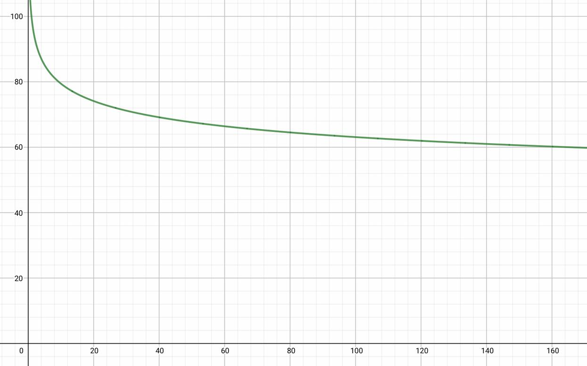

 
 <h1 align="center">CMO </h1>
 

  <b>时序控制系统及自动目标测试</b>
 

 <h1 align="center"></h1>
 

   
  <b><b>Санкт-Петербургский государственный политехнический университет</b> </b>
  <b>Институт компьютерных наук и технологий</b>
  <h1 align="center"></h1>
 

 

## 分析
所有的文件都应该有一根时间线(TimeLine)来贯穿，同时请求(request)应作为事件(event)的最小单位，**CMO 系统中的所有事务都应该是对于请求而言**

**需要一下的功能模块：**
 - 事件（Event）
 - 时间线（TimeLine）同时带有日志功能
 - 请求（Request）
 - 源（Source）
 - 缓冲区（Buffer）
 - 处理机（Device）

---

**各模块类型的简要概述：**

原文：
 - ИБ - бесконечный (источники)
 - ИЗ2 - равномерный (законы распределения)
 - ПЗ1 – экспоненциальный (законы распределения времени прибор)
 - Д10З3 - на свободное место (записи в буфер, если есть место)
 - Д10О5 – вновь пришедшая (дисциплины отказа)
 - Д2П1 - приоритет по номеру прибора (выбор прибора)
 - Д2Б4 - приоритет по номеру источника, по одной заявке (выбор заявки из буфера)
 - ОД1 - календарь событий, буфер и текущее состояние (отображение динамики функционирования модели)
 - ОР1 - сводная таблица результатов (отображение результатов)

---

中文：
 - ИБ：源的类型为无限源（一直生成请求）
 - ИЗ2：每个源生成请求的间隔为**等长**的
 - ПЗ1：对于每个处理机处理请求的时长为**负指数增长**
 - Д10З3：对于请求插入缓冲区的规则为，按照顺序选择缓冲区,插入空闲的缓冲区。不存在转移队列
 - Д10О5：如果没有空闲的处理机及缓冲区，请求应直接离开系统，并且不得改变缓冲区的任何状态
 - Д2П1：处理机的优先级和源的优先级都由其编号决定，选择**优先级最大的处理机**进行处理请求
 - Д2Б4：从缓冲区中选择请求的规则为，选择**优先级最高**的请求（请求的优先级就是源的编号），如果缓冲区中有多个同优先级的请求，优先选择最后进入缓冲区的
 - ОД1：手动测试模式，输出日志、缓冲区及当前的事件
 - ОР1：自动测试模式，输出测试结果

---

## 架构

## 模拟时序图

## 程序框图

## 文件职责

### 时间线（TimeLine）
时间线应该作为穿插各功能模块的线，带有日志功能以方便后续的统计及图表生成

**开发说明：**
 - 使用单例模式，每次程序运行应该只有一条时间线
 - 从 0 开始计时（计数），每次增加一个时间单位。每单位的时间是多长应在初始化时进行确定
 - 程序运行后应通过时间线中的时间对 buffer/device/source 进行判断，看里面是否记录有需要执行的任务
 - 包含一个日志，记录发生了的时间，并将其写入文件（使用列表存储）

**属性：**
 - 当前时间 **（只允许递增！）**
 - 记录事件的列表（日志）

### 事件（Event）
记录系统中发生的单个事件，作为时间线（程序）的最小单位

**属性：**
 - 当前时间
 - 事件类型
   - 生成请求
   - 请求进入缓冲区
   - 请求离开缓冲区
   - 请求进入处理机
   - 请求离开处理机
   - 请求被取消
 - 本 CMO 生成的第几个请求
 - 生成这个请求的源ID
 - 请求在他的生成源的ID
 - 缓冲区ID
 - 处理机ID
 - 系统中当前空闲缓冲区的数量
 - 系统中当前空闲处理机的数量

### 请求（Request）
由源生成，作为一个对象可以在源、缓冲区、处理机之间相互传递

包含的属性：
 - [Static]  整个系统累计生成的请求的数量
 - [Static]  整个系统累计取消的请求的数量
 - 产生这个请求的源
 - 这个请求在它源中的ID
 - 在整个 CMO 中的唯一 ID

### 源（Source）
 - _static_ 当前 CMO 中的源的总数
 - 源 ID
 - 源的优先级
 - 下一个请求发生的时间
 - 本源的服务时间（各请求在源的停留时间**总和**）
 - 时间线（用户传入）

### 缓冲区（Buffer）
 - _static_ 当前 CMO 中的缓冲区总数
 - 缓冲区 ID
 - 缓冲区优先级
 - 当前在缓冲区中的请求
 - 上一个/当前 请求进入缓冲区的时间
 - 本缓冲区中存留过的请求总数
 - 本缓冲区的服务时间（各请求在缓冲区的停留时间**总和**）
 - 时间线（用户传入）

### 处理机（Device）
 - _static_ 当前 CMO 中的处理机总数
 - 处理机 ID
 - 处理机优先级
 - 当前在处理机中的请求
 - 上一个/当前 请求进入处理机的时间
 - 当前请求处理结束的时间（未来）
 - 本处理机中处理过的请求总数
 - 本处理机的服务时间（各请求在处理机中的停留时间**总和**）
 - 时间线（用户传入）

---

   处理机的处理时间应该为**负指数增长**，即**越往后的请求，处理越快**

​	公式：

​	**$$ 处理时间 = MaxTime \cdot X^{-LAMBDA} $$**

- `MaxTime` - **最大的处理时间**，即第一个请求所需的时间（*$MaxTime > 0$*）
- `X` - 第几个请求（$X > 0, X∈Z $）
- `LAMBDA` - 参数，越接近 1，函数递减的就越快（$0 < LAMBDA < 1$）

---

示例：

+ $$ 处理时间 = 100 \cdot X^{-0.1} $$

  

+ $$ 处理时间 = 100 \cdot X^{-0.2} $$

  

+ $$ 处理时间 = 100 \cdot X^{-0.3} $$

  

+ $$ 处理时间 = 100 \cdot X^{-0.4} $$

  

+ $$ 处理时间 = 100 \cdot X^{-0.5} $$

  

## 应用系统解决实际问题

需求场景：模拟客户到达银行，在客户的离开率不超过1%的情况下，找到建设银行花费最小的方案

对应到 CMO 系统中：

| CMO 系统模块     | 实际问题中的模块       | 描述                                                         |
| ---------------- | ---------------------- | ------------------------------------------------------------ |
| 请求（Request）  | 客户                   | 到达银行的客户                                               |
| 源（Device）     | 客户的来源             | 客户可能乘坐地铁（10分钟一班）、公交（30分钟一班）、有轨电车（20分钟一班）、无轨电车（15分钟一班）、步行（50分钟）到达银行。这些到达银行的方式可以视为**源**，源每隔固定时间间隔产生请求即为客户通过固定时间间隔到达银行 |
| 缓冲区（Buffer） | 银行中的等待室         | 银行中的等待室，可以考虑成这是一个位置（沙发）。如果其中一个沙发被占用了，那么其他客户就不得再占用 |
| 处理机（Device） | 银行中的柜台和工作人员 | 用于处理客户（请求），处理时间随着下班时间的临近成负指数增长 |

发生的情况：

| CMO 系统描述               | 实际问题                                                     |
| -------------------------- | ------------------------------------------------------------ |
| 请求产生                   | 客户到达银行                                                 |
| 请求进入缓冲区             | 客户通过取号机区号，进行排队（进入等候室）                   |
| 请求离开缓冲区，进入处理机 | 此时有空闲的柜台，客户离开等候室，进入柜台处理业务           |
| 请求离开处理机             | 客户的业务完成，客户离开银行                                 |
| 请求被取消                 | 银行此时处于繁忙状态，即所有的柜台都繁忙，并且等候室也没有空位 |

其中：

- 建设一个等候室需要花费 50000 卢布
- 建设一个柜台及聘用相关人员需要 200000 卢布
- 模拟银行每天需要处理 300 位客户
- 客户的离开率不得高于1%

经过建模模拟后取得结果，得到最优解：

<html xmlns:v="urn:schemas-microsoft-com:vml"
xmlns:o="urn:schemas-microsoft-com:office:office"
xmlns:x="urn:schemas-microsoft-com:office:excel"
xmlns="http://www.w3.org/TR/REC-html40">

<head>
<meta http-equiv=Content-Type content="text/html; charset=gb2312">
<meta name=ProgId content=Excel.Sheet>
<meta name=Generator content="Microsoft Excel 15">
<link id=Main-File rel=Main-File href="../file9903.htm">
<link rel=File-List href=filelist.xml>
<![if IE]>
<base href="file:///C:/FC98752F/file9903.files/sheet001.htm"
id="webarch_temp_base_tag">
<![endif]>
<link rel=Stylesheet href=stylesheet.css>

<![if !supportTabStrip]>
<![endif]>
</head>

<body link="#0563C1" vlink="#954F72" class=xl65>

<table border=0 cellpadding=0 cellspacing=0 width=575 style='border-collapse:
 collapse;table-layout:fixed;width:432pt'>
 <col class=xl65 width=77 style='mso-width-source:userset;mso-width-alt:2816;
 width:58pt'>
 <col class=xl65 width=111 span=2 style='mso-width-source:userset;mso-width-alt:
 4059;width:83pt'>
 <col class=xl65 width=138 span=2 style='width:104pt'>
 <tr height=29 style='mso-height-source:userset;height:21.75pt'>
  <td height=29 class=xl69 width=77 style='height:21.75pt;width:58pt'>源的数量</td>
  <td class=xl69 width=111 style='border-left:none;width:83pt'>等候区数量</td>
  <td class=xl69 width=111 style='border-left:none;width:83pt'>服务窗口数量</td>
  <td class=xl69 width=138 style='border-left:none;width:104pt'>请求被取消概率</td>
  <td class=xl69 width=138 style='border-left:none;width:104pt'>总花费</td>
 </tr>
 <tr height=29 style='mso-height-source:userset;height:21.75pt'>
  <td height=29 class=xl68 style='height:21.75pt'>5</td>
  <td class=xl68 style='border-left:none;border-top:none;border-right:.5pt solid windowtext;
  border-bottom:.5pt solid windowtext;border-left:.5pt solid windowtext;
  background:#FCFCFF;mso-pattern:black none'>1</td>
  <td class=xl68 style='border-left:none;border-top:none;border-right:.5pt solid windowtext;
  border-bottom:.5pt solid windowtext;border-left:.5pt solid windowtext;
  background:#FCFCFF;mso-pattern:black none'>1</td>
  <td class=xl68 style='border-left:none;border-top:none;border-right:.5pt solid windowtext;
  border-bottom:.5pt solid windowtext;border-left:.5pt solid windowtext;
  background:#F8696B;mso-pattern:black none'>0.54485</td>
  <td class=xl68 style='border-left:none;border-top:none;border-right:.5pt solid windowtext;
  border-bottom:.5pt solid windowtext;border-left:.5pt solid windowtext;
  background:#63BE7B;mso-pattern:black none'>2500000</td>
 </tr>
 <tr height=29 style='mso-height-source:userset;height:21.75pt'>
  <td height=29 class=xl66 style='height:21.75pt;border-top:none'>5</td>
  <td class=xl66 style='border-top:none;border-left:none;border:.5pt solid windowtext;
  background:#EBF6F1;mso-pattern:black none'>2</td>
  <td class=xl66 style='border-top:none;border-left:none;border:.5pt solid windowtext;
  background:#FCFCFF;mso-pattern:black none'>1</td>
  <td class=xl66 style='border-top:none;border-left:none;border:.5pt solid windowtext;
  background:#FB9B75;mso-pattern:black none'>0.34437</td>
  <td class=xl66 style='border-top:none;border-left:none;border:.5pt solid windowtext;
  background:#69C07B;mso-pattern:black none'>3000000</td>
 </tr>
 <tr height=29 style='mso-height-source:userset;height:21.75pt'>
  <td height=29 class=xl66 style='height:21.75pt;border-top:none'>5</td>
  <td class=xl66 style='border-top:none;border-left:none;border:.5pt solid windowtext;
  background:#DAEFE2;mso-pattern:black none'>3</td>
  <td class=xl66 style='border-top:none;border-left:none;border:.5pt solid windowtext;
  background:#FCFCFF;mso-pattern:black none'>1</td>
  <td class=xl66 style='border-top:none;border-left:none;border:.5pt solid windowtext;
  background:#FCB27A;mso-pattern:black none'>0.25166</td>
  <td class=xl66 style='border-top:none;border-left:none;border:.5pt solid windowtext;
  background:#70C27B;mso-pattern:black none'>3500000</td>
 </tr>
 <tr height=29 style='mso-height-source:userset;height:21.75pt'>
  <td height=29 class=xl66 style='height:21.75pt;border-top:none'>5</td>
  <td class=xl66 style='border-top:none;border-left:none;border:.5pt solid windowtext;
  background:#C9E8D3;mso-pattern:black none'>4</td>
  <td class=xl66 style='border-top:none;border-left:none;border:.5pt solid windowtext;
  background:#FCFCFF;mso-pattern:black none'>1</td>
  <td class=xl66 style='border-top:none;border-left:none;border:.5pt solid windowtext;
  background:#FDBC7B;mso-pattern:black none'>0.21262</td>
  <td class=xl66 style='border-top:none;border-left:none;border:.5pt solid windowtext;
  background:#77C47C;mso-pattern:black none'>4000000</td>
 </tr>
 <tr height=29 style='mso-height-source:userset;height:21.75pt'>
  <td height=29 class=xl66 style='height:21.75pt;border-top:none'>5</td>
  <td class=xl66 style='border-top:none;border-left:none;border:.5pt solid windowtext;
  background:#FCFCFF;mso-pattern:black none'>1</td>
  <td class=xl66 style='border-top:none;border-left:none;border:.5pt solid windowtext;
  background:#EBF6F1;mso-pattern:black none'>2</td>
  <td class=xl66 style='border-top:none;border-left:none;border:.5pt solid windowtext;
  background:#F9706D;mso-pattern:black none'>0.51827</td>
  <td class=xl66 style='border-top:none;border-left:none;border:.5pt solid windowtext;
  background:#7EC67C;mso-pattern:black none'>4500000</td>
 </tr>
 <tr height=29 style='mso-height-source:userset;height:21.75pt'>
  <td height=29 class=xl66 style='height:21.75pt;border-top:none'>5</td>
  <td class=xl66 style='border-top:none;border-left:none;border:.5pt solid windowtext;
  background:#B8E1C5;mso-pattern:black none'>5</td>
  <td class=xl66 style='border-top:none;border-left:none;border:.5pt solid windowtext;
  background:#FCFCFF;mso-pattern:black none'>1</td>
  <td class=xl66 style='border-top:none;border-left:none;border:.5pt solid windowtext;
  background:#FDBE7C;mso-pattern:black none'>0.20598</td>
  <td class=xl66 style='border-top:none;border-left:none;border:.5pt solid windowtext;
  background:#7EC67C;mso-pattern:black none'>4500000</td>
 </tr>
 <tr height=29 style='mso-height-source:userset;height:21.75pt'>
  <td height=29 class=xl66 style='height:21.75pt;border-top:none'>5</td>
  <td class=xl66 style='border-top:none;border-left:none;border:.5pt solid windowtext;
  background:#EBF6F1;mso-pattern:black none'>2</td>
  <td class=xl66 style='border-top:none;border-left:none;border:.5pt solid windowtext;
  background:#EBF6F1;mso-pattern:black none'>2</td>
  <td class=xl66 style='border-top:none;border-left:none;border:.5pt solid windowtext;
  background:#FCAD79;mso-pattern:black none'>0.27243</td>
  <td class=xl66 style='border-top:none;border-left:none;border:.5pt solid windowtext;
  background:#85C87D;mso-pattern:black none'>5000000</td>
 </tr>
 <tr height=29 style='mso-height-source:userset;height:21.75pt'>
  <td height=29 class=xl66 style='height:21.75pt;border-top:none'>5</td>
  <td class=xl66 style='border-top:none;border-left:none;border:.5pt solid windowtext;
  background:#A7DAB6;mso-pattern:black none'>6</td>
  <td class=xl66 style='border-top:none;border-left:none;border:.5pt solid windowtext;
  background:#FCFCFF;mso-pattern:black none'>1</td>
  <td class=xl66 style='border-top:none;border-left:none;border:.5pt solid windowtext;
  background:#FDBF7C;mso-pattern:black none'>0.20266</td>
  <td class=xl66 style='border-top:none;border-left:none;border:.5pt solid windowtext;
  background:#85C87D;mso-pattern:black none'>5000000</td>
 </tr>
 <tr height=29 style='mso-height-source:userset;height:21.75pt'>
  <td height=29 class=xl66 style='height:21.75pt;border-top:none'>5</td>
  <td class=xl66 style='border-top:none;border-left:none;border:.5pt solid windowtext;
  background:#DAEFE2;mso-pattern:black none'>3</td>
  <td class=xl66 style='border-top:none;border-left:none;border:.5pt solid windowtext;
  background:#EBF6F1;mso-pattern:black none'>2</td>
  <td class=xl66 style='border-top:none;border-left:none;border:.5pt solid windowtext;
  background:#FECD7F;mso-pattern:black none'>0.14618</td>
  <td class=xl66 style='border-top:none;border-left:none;border:.5pt solid windowtext;
  background:#8CCA7D;mso-pattern:black none'>5500000</td>
 </tr>
 <tr height=29 style='mso-height-source:userset;height:21.75pt'>
  <td height=29 class=xl66 style='height:21.75pt;border-top:none'>5</td>
  <td class=xl66 style='border-top:none;border-left:none;border:.5pt solid windowtext;
  background:#96D3A7;mso-pattern:black none'>7</td>
  <td class=xl66 style='border-top:none;border-left:none;border:.5pt solid windowtext;
  background:#FCFCFF;mso-pattern:black none'>1</td>
  <td class=xl66 style='border-top:none;border-left:none;border:.5pt solid windowtext;
  background:#FDBF7C;mso-pattern:black none'>0.19934</td>
  <td class=xl66 style='border-top:none;border-left:none;border:.5pt solid windowtext;
  background:#8CCA7D;mso-pattern:black none'>5500000</td>
 </tr>
 <tr height=29 style='mso-height-source:userset;height:21.75pt'>
  <td height=29 class=xl66 style='height:21.75pt;border-top:none'>5</td>
  <td class=xl66 style='border-top:none;border-left:none;border:.5pt solid windowtext;
  background:#C9E8D3;mso-pattern:black none'>4</td>
  <td class=xl66 style='border-top:none;border-left:none;border:.5pt solid windowtext;
  background:#EBF6F1;mso-pattern:black none'>2</td>
  <td class=xl66 style='border-top:none;border-left:none;border:.5pt solid windowtext;
  background:#FFDC82;mso-pattern:black none'>0.08306</td>
  <td class=xl66 style='border-top:none;border-left:none;border:.5pt solid windowtext;
  background:#93CC7D;mso-pattern:black none'>6000000</td>
 </tr>
 <tr height=29 style='mso-height-source:userset;height:21.75pt'>
  <td height=29 class=xl66 style='height:21.75pt;border-top:none'>5</td>
  <td class=xl66 style='border-top:none;border-left:none;border:.5pt solid windowtext;
  background:#85CC99;mso-pattern:black none'>8</td>
  <td class=xl66 style='border-top:none;border-left:none;border:.5pt solid windowtext;
  background:#FCFCFF;mso-pattern:black none'>1</td>
  <td class=xl66 style='border-top:none;border-left:none;border:.5pt solid windowtext;
  background:#FDC07C;mso-pattern:black none'>0.19601</td>
  <td class=xl66 style='border-top:none;border-left:none;border:.5pt solid windowtext;
  background:#93CC7D;mso-pattern:black none'>6000000</td>
 </tr>
 <tr height=29 style='mso-height-source:userset;height:21.75pt'>
  <td height=29 class=xl66 style='height:21.75pt;border-top:none'>5</td>
  <td class=xl66 style='border-top:none;border-left:none;border:.5pt solid windowtext;
  background:#FCFCFF;mso-pattern:black none'>1</td>
  <td class=xl66 style='border-top:none;border-left:none;border:.5pt solid windowtext;
  background:#DAEFE2;mso-pattern:black none'>3</td>
  <td class=xl66 style='border-top:none;border-left:none;border:.5pt solid windowtext;
  background:#F9736D;mso-pattern:black none'>0.50831</td>
  <td class=xl66 style='border-top:none;border-left:none;border:.5pt solid windowtext;
  background:#9ACE7E;mso-pattern:black none'>6500000</td>
 </tr>
 <tr height=29 style='mso-height-source:userset;height:21.75pt'>
  <td height=29 class=xl66 style='height:21.75pt;border-top:none'>5</td>
  <td class=xl66 style='border-top:none;border-left:none;border:.5pt solid windowtext;
  background:#B8E1C5;mso-pattern:black none'>5</td>
  <td class=xl66 style='border-top:none;border-left:none;border:.5pt solid windowtext;
  background:#EBF6F1;mso-pattern:black none'>2</td>
  <td class=xl66 style='border-top:none;border-left:none;border:.5pt solid windowtext;
  background:#FFE082;mso-pattern:black none'>0.06977</td>
  <td class=xl66 style='border-top:none;border-left:none;border:.5pt solid windowtext;
  background:#9ACE7E;mso-pattern:black none'>6500000</td>
 </tr>
 <tr height=29 style='mso-height-source:userset;height:21.75pt'>
  <td height=29 class=xl66 style='height:21.75pt;border-top:none'>5</td>
  <td class=xl66 style='border-top:none;border-left:none;border:.5pt solid windowtext;
  background:#74C58A;mso-pattern:black none'>9</td>
  <td class=xl66 style='border-top:none;border-left:none;border:.5pt solid windowtext;
  background:#FCFCFF;mso-pattern:black none'>1</td>
  <td class=xl66 style='border-top:none;border-left:none;border:.5pt solid windowtext;
  background:#FDC17C;mso-pattern:black none'>0.19269</td>
  <td class=xl66 style='border-top:none;border-left:none;border:.5pt solid windowtext;
  background:#9ACE7E;mso-pattern:black none'>6500000</td>
 </tr>
 <tr height=29 style='mso-height-source:userset;height:21.75pt'>
  <td height=29 class=xl66 style='height:21.75pt;border-top:none'>5</td>
  <td class=xl66 style='border-top:none;border-left:none;border:.5pt solid windowtext;
  background:#EBF6F1;mso-pattern:black none'>2</td>
  <td class=xl66 style='border-top:none;border-left:none;border:.5pt solid windowtext;
  background:#DAEFE2;mso-pattern:black none'>3</td>
  <td class=xl66 style='border-top:none;border-left:none;border:.5pt solid windowtext;
  background:#FCB279;mso-pattern:black none'>0.25249</td>
  <td class=xl66 style='border-top:none;border-left:none;border:.5pt solid windowtext;
  background:#A1D07E;mso-pattern:black none'>7000000</td>
 </tr>
 <tr height=29 style='mso-height-source:userset;height:21.75pt'>
  <td height=29 class=xl66 style='height:21.75pt;border-top:none'>5</td>
  <td class=xl66 style='border-top:none;border-left:none;border:.5pt solid windowtext;
  background:#A7DAB6;mso-pattern:black none'>6</td>
  <td class=xl66 style='border-top:none;border-left:none;border:.5pt solid windowtext;
  background:#EBF6F1;mso-pattern:black none'>2</td>
  <td class=xl66 style='border-top:none;border-left:none;border:.5pt solid windowtext;
  background:#FFE082;mso-pattern:black none'>0.06645</td>
  <td class=xl66 style='border-top:none;border-left:none;border:.5pt solid windowtext;
  background:#A1D07E;mso-pattern:black none'>7000000</td>
 </tr>
 <tr height=29 style='mso-height-source:userset;height:21.75pt'>
  <td height=29 class=xl66 style='height:21.75pt;border-top:none'>5</td>
  <td class=xl66 style='border-top:none;border-left:none;border:.5pt solid windowtext;
  background:#63BE7B;mso-pattern:black none'>10</td>
  <td class=xl66 style='border-top:none;border-left:none;border:.5pt solid windowtext;
  background:#FCFCFF;mso-pattern:black none'>1</td>
  <td class=xl66 style='border-top:none;border-left:none;border:.5pt solid windowtext;
  background:#FDC27C;mso-pattern:black none'>0.18937</td>
  <td class=xl66 style='border-top:none;border-left:none;border:.5pt solid windowtext;
  background:#A1D07E;mso-pattern:black none'>7000000</td>
 </tr>
 <tr height=29 style='mso-height-source:userset;height:21.75pt'>
  <td height=29 class=xl66 style='height:21.75pt;border-top:none'>5</td>
  <td class=xl66 style='border-top:none;border-left:none;border:.5pt solid windowtext;
  background:#DAEFE2;mso-pattern:black none'>3</td>
  <td class=xl66 style='border-top:none;border-left:none;border:.5pt solid windowtext;
  background:#DAEFE2;mso-pattern:black none'>3</td>
  <td class=xl66 style='border-top:none;border-left:none;border:.5pt solid windowtext;
  background:#FED580;mso-pattern:black none'>0.11296</td>
  <td class=xl66 style='border-top:none;border-left:none;border:.5pt solid windowtext;
  background:#A8D27F;mso-pattern:black none'>7500000</td>
 </tr>
 <tr height=29 style='mso-height-source:userset;height:21.75pt'>
  <td height=29 class=xl66 style='height:21.75pt;border-top:none'>5</td>
  <td class=xl66 style='border-top:none;border-left:none;border:.5pt solid windowtext;
  background:#96D3A7;mso-pattern:black none'>7</td>
  <td class=xl66 style='border-top:none;border-left:none;border:.5pt solid windowtext;
  background:#EBF6F1;mso-pattern:black none'>2</td>
  <td class=xl66 style='border-top:none;border-left:none;border:.5pt solid windowtext;
  background:#FFE183;mso-pattern:black none'>0.06312</td>
  <td class=xl66 style='border-top:none;border-left:none;border:.5pt solid windowtext;
  background:#A8D27F;mso-pattern:black none'>7500000</td>
 </tr>
 <tr height=29 style='mso-height-source:userset;height:21.75pt'>
  <td height=29 class=xl66 style='height:21.75pt;border-top:none'>5</td>
  <td class=xl66 style='border-top:none;border-left:none;border:.5pt solid windowtext;
  background:#C9E8D3;mso-pattern:black none'>4</td>
  <td class=xl66 style='border-top:none;border-left:none;border:.5pt solid windowtext;
  background:#DAEFE2;mso-pattern:black none'>3</td>
  <td class=xl66 style='border-top:none;border-left:none;border:.5pt solid windowtext;
  background:#FFE583;mso-pattern:black none'>0.04651</td>
  <td class=xl66 style='border-top:none;border-left:none;border:.5pt solid windowtext;
  background:#AFD47F;mso-pattern:black none'>8000000</td>
 </tr>
 <tr height=29 style='mso-height-source:userset;height:21.75pt'>
  <td height=29 class=xl66 style='height:21.75pt;border-top:none'>5</td>
  <td class=xl66 style='border-top:none;border-left:none;border:.5pt solid windowtext;
  background:#85CC99;mso-pattern:black none'>8</td>
  <td class=xl66 style='border-top:none;border-left:none;border:.5pt solid windowtext;
  background:#EBF6F1;mso-pattern:black none'>2</td>
  <td class=xl66 style='border-top:none;border-left:none;border:.5pt solid windowtext;
  background:#FFE283;mso-pattern:black none'>0.0598</td>
  <td class=xl66 style='border-top:none;border-left:none;border:.5pt solid windowtext;
  background:#AFD47F;mso-pattern:black none'>8000000</td>
 </tr>
 <tr height=29 style='mso-height-source:userset;height:21.75pt'>
  <td height=29 class=xl66 style='height:21.75pt;border-top:none'>5</td>
  <td class=xl66 style='border-top:none;border-left:none;border:.5pt solid windowtext;
  background:#FCFCFF;mso-pattern:black none'>1</td>
  <td class=xl66 style='border-top:none;border-left:none;border:.5pt solid windowtext;
  background:#C9E8D3;mso-pattern:black none'>4</td>
  <td class=xl66 style='border-top:none;border-left:none;border:.5pt solid windowtext;
  background:#F9736D;mso-pattern:black none'>0.50498</td>
  <td class=xl66 style='border-top:none;border-left:none;border:.5pt solid windowtext;
  background:#B6D67F;mso-pattern:black none'>8500000</td>
 </tr>
 <tr height=29 style='mso-height-source:userset;height:21.75pt'>
  <td height=29 class=xl66 style='height:21.75pt;border-top:none'>5</td>
  <td class=xl66 style='border-top:none;border-left:none;border:.5pt solid windowtext;
  background:#B8E1C5;mso-pattern:black none'>5</td>
  <td class=xl66 style='border-top:none;border-left:none;border:.5pt solid windowtext;
  background:#DAEFE2;mso-pattern:black none'>3</td>
  <td class=xl66 style='border-top:none;border-left:none;border:.5pt solid windowtext;
  background:#FFE984;mso-pattern:black none'>0.03322</td>
  <td class=xl66 style='border-top:none;border-left:none;border:.5pt solid windowtext;
  background:#B6D67F;mso-pattern:black none'>8500000</td>
 </tr>
 <tr height=29 style='mso-height-source:userset;height:21.75pt'>
  <td height=29 class=xl66 style='height:21.75pt;border-top:none'>5</td>
  <td class=xl66 style='border-top:none;border-left:none;border:.5pt solid windowtext;
  background:#74C58A;mso-pattern:black none'>9</td>
  <td class=xl66 style='border-top:none;border-left:none;border:.5pt solid windowtext;
  background:#EBF6F1;mso-pattern:black none'>2</td>
  <td class=xl66 style='border-top:none;border-left:none;border:.5pt solid windowtext;
  background:#FFE383;mso-pattern:black none'>0.05648</td>
  <td class=xl66 style='border-top:none;border-left:none;border:.5pt solid windowtext;
  background:#B6D67F;mso-pattern:black none'>8500000</td>
 </tr>
 <tr height=29 style='mso-height-source:userset;height:21.75pt'>
  <td height=29 class=xl66 style='height:21.75pt;border-top:none'>5</td>
  <td class=xl66 style='border-top:none;border-left:none;border:.5pt solid windowtext;
  background:#EBF6F1;mso-pattern:black none'>2</td>
  <td class=xl66 style='border-top:none;border-left:none;border:.5pt solid windowtext;
  background:#C9E8D3;mso-pattern:black none'>4</td>
  <td class=xl66 style='border-top:none;border-left:none;border:.5pt solid windowtext;
  background:#FDB57A;mso-pattern:black none'>0.24252</td>
  <td class=xl66 style='border-top:none;border-left:none;border:.5pt solid windowtext;
  background:#BDD780;mso-pattern:black none'>9000000</td>
 </tr>
 <tr height=29 style='mso-height-source:userset;height:21.75pt'>
  <td height=29 class=xl66 style='height:21.75pt;border-top:none'>5</td>
  <td class=xl66 style='border-top:none;border-left:none;border:.5pt solid windowtext;
  background:#A7DAB6;mso-pattern:black none'>6</td>
  <td class=xl66 style='border-top:none;border-left:none;border:.5pt solid windowtext;
  background:#DAEFE2;mso-pattern:black none'>3</td>
  <td class=xl66 style='border-top:none;border-left:none;border:.5pt solid windowtext;
  background:#FFE984;mso-pattern:black none'>0.0299</td>
  <td class=xl66 style='border-top:none;border-left:none;border:.5pt solid windowtext;
  background:#BDD780;mso-pattern:black none'>9000000</td>
 </tr>
 <tr height=29 style='mso-height-source:userset;height:21.75pt'>
  <td height=29 class=xl66 style='height:21.75pt;border-top:none'>5</td>
  <td class=xl66 style='border-top:none;border-left:none;border:.5pt solid windowtext;
  background:#63BE7B;mso-pattern:black none'>10</td>
  <td class=xl66 style='border-top:none;border-left:none;border:.5pt solid windowtext;
  background:#EBF6F1;mso-pattern:black none'>2</td>
  <td class=xl66 style='border-top:none;border-left:none;border:.5pt solid windowtext;
  background:#FFE483;mso-pattern:black none'>0.05316</td>
  <td class=xl66 style='border-top:none;border-left:none;border:.5pt solid windowtext;
  background:#BDD780;mso-pattern:black none'>9000000</td>
 </tr>
 <tr height=29 style='mso-height-source:userset;height:21.75pt'>
  <td height=29 class=xl66 style='height:21.75pt;border-top:none'>5</td>
  <td class=xl66 style='border-top:none;border-left:none;border:.5pt solid windowtext;
  background:#DAEFE2;mso-pattern:black none'>3</td>
  <td class=xl66 style='border-top:none;border-left:none;border:.5pt solid windowtext;
  background:#C9E8D3;mso-pattern:black none'>4</td>
  <td class=xl66 style='border-top:none;border-left:none;border:.5pt solid windowtext;
  background:#FED881;mso-pattern:black none'>0.09967</td>
  <td class=xl66 style='border-top:none;border-left:none;border:.5pt solid windowtext;
  background:#C4DA80;mso-pattern:black none'>9500000</td>
 </tr>
 <tr height=29 style='mso-height-source:userset;height:21.75pt'>
  <td height=29 class=xl66 style='height:21.75pt;border-top:none'>5</td>
  <td class=xl66 style='border-top:none;border-left:none;border:.5pt solid windowtext;
  background:#96D3A7;mso-pattern:black none'>7</td>
  <td class=xl66 style='border-top:none;border-left:none;border:.5pt solid windowtext;
  background:#DAEFE2;mso-pattern:black none'>3</td>
  <td class=xl66 style='border-top:none;border-left:none;border:.5pt solid windowtext;
  background:#FFEA84;mso-pattern:black none'>0.02658</td>
  <td class=xl66 style='border-top:none;border-left:none;border:.5pt solid windowtext;
  background:#C4DA80;mso-pattern:black none'>9500000</td>
 </tr>
 <tr height=29 style='mso-height-source:userset;height:21.75pt'>
  <td height=29 class=xl66 style='height:21.75pt;border-top:none'>5</td>
  <td class=xl66 style='border-top:none;border-left:none;border:.5pt solid windowtext;
  background:#C9E8D3;mso-pattern:black none'>4</td>
  <td class=xl66 style='border-top:none;border-left:none;border:.5pt solid windowtext;
  background:#C9E8D3;mso-pattern:black none'>4</td>
  <td class=xl66 style='border-top:none;border-left:none;border:.5pt solid windowtext;
  background:#FFEA84;mso-pattern:black none'>0.02658</td>
  <td class=xl66 style='border-top:none;border-left:none;border:.5pt solid windowtext;
  background:#CBDC81;mso-pattern:black none'>10000000</td>
 </tr>
 <tr height=29 style='mso-height-source:userset;height:21.75pt'>
  <td height=29 class=xl66 style='height:21.75pt;border-top:none'>5</td>
  <td class=xl66 style='border-top:none;border-left:none;border:.5pt solid windowtext;
  background:#85CC99;mso-pattern:black none'>8</td>
  <td class=xl66 style='border-top:none;border-left:none;border:.5pt solid windowtext;
  background:#DAEFE2;mso-pattern:black none'>3</td>
  <td class=xl66 style='border-top:none;border-left:none;border:.5pt solid windowtext;
  background:#FFEB84;mso-pattern:black none'>0.02326</td>
  <td class=xl66 style='border-top:none;border-left:none;border:.5pt solid windowtext;
  background:#CBDC81;mso-pattern:black none'>10000000</td>
 </tr>
 <tr height=29 style='mso-height-source:userset;height:21.75pt'>
  <td height=29 class=xl66 style='height:21.75pt;border-top:none'>5</td>
  <td class=xl66 style='border-top:none;border-left:none;border:.5pt solid windowtext;
  background:#FCFCFF;mso-pattern:black none'>1</td>
  <td class=xl66 style='border-top:none;border-left:none;border:.5pt solid windowtext;
  background:#B8E1C5;mso-pattern:black none'>5</td>
  <td class=xl66 style='border-top:none;border-left:none;border:.5pt solid windowtext;
  background:#F9736D;mso-pattern:black none'>0.50498</td>
  <td class=xl66 style='border-top:none;border-left:none;border:.5pt solid windowtext;
  background:#D1DE81;mso-pattern:black none'>10500000</td>
 </tr>
 <tr height=29 style='mso-height-source:userset;height:21.75pt'>
  <td height=29 class=xl66 style='height:21.75pt;border-top:none'>5</td>
  <td class=xl66 style='border-top:none;border-left:none;border:.5pt solid windowtext;
  background:#B8E1C5;mso-pattern:black none'>5</td>
  <td class=xl66 style='border-top:none;border-left:none;border:.5pt solid windowtext;
  background:#C9E8D3;mso-pattern:black none'>4</td>
  <td class=xl66 style='border-top:none;border-left:none;border:.5pt solid windowtext;
  background:#C3D980;mso-pattern:black none'>0.01329</td>
  <td class=xl66 style='border-top:none;border-left:none;border:.5pt solid windowtext;
  background:#D1DE81;mso-pattern:black none'>10500000</td>
 </tr>
 <tr height=29 style='mso-height-source:userset;height:21.75pt'>
  <td height=29 class=xl66 style='height:21.75pt;border-top:none'>5</td>
  <td class=xl66 style='border-top:none;border-left:none;border:.5pt solid windowtext;
  background:#74C58A;mso-pattern:black none'>9</td>
  <td class=xl66 style='border-top:none;border-left:none;border:.5pt solid windowtext;
  background:#DAEFE2;mso-pattern:black none'>3</td>
  <td class=xl66 style='border-top:none;border-left:none;border:.5pt solid windowtext;
  background:#F2E783;mso-pattern:black none'>0.01993</td>
  <td class=xl66 style='border-top:none;border-left:none;border:.5pt solid windowtext;
  background:#D1DE81;mso-pattern:black none'>10500000</td>
 </tr>
 <tr height=29 style='mso-height-source:userset;height:21.75pt'>
  <td height=29 class=xl67 style='height:21.75pt;border-top:none'>5</td>
  <td class=xl67 style='border-top:none;border-left:none;border-top:.5pt solid windowtext;
  border-right:.5pt solid windowtext;border-bottom:none;border-left:.5pt solid windowtext;
  background:#EBF6F1;mso-pattern:black none'>2</td>
  <td class=xl67 style='border-top:none;border-left:none;border-top:.5pt solid windowtext;
  border-right:.5pt solid windowtext;border-bottom:none;border-left:.5pt solid windowtext;
  background:#B8E1C5;mso-pattern:black none'>5</td>
  <td class=xl67 style='border-top:none;border-left:none;border-top:.5pt solid windowtext;
  border-right:.5pt solid windowtext;border-bottom:none;border-left:.5pt solid windowtext;
  background:#FDB57A;mso-pattern:black none'>0.2392</td>
  <td class=xl67 style='border-top:none;border-left:none;border-top:.5pt solid windowtext;
  border-right:.5pt solid windowtext;border-bottom:none;border-left:.5pt solid windowtext;
  background:#D8E081;mso-pattern:black none'>11000000</td>
 </tr>
 <tr height=29 style='mso-height-source:userset;height:21.75pt'>
  <td height=29 class=xl72 style='height:21.75pt'>5</td>
  <td class=xl70 style='border-left:none;font-size:11.0pt;color:black;
  font-weight:700;text-decoration:none;text-underline-style:none;text-line-through:
  none;font-family:Calibri, sans-serif;border-top:1.0pt dot-dash-slanted lime;
  border-right:.5pt solid windowtext;border-bottom:1.0pt dot-dash-slanted lime;
  border-left:.5pt solid windowtext;background:#A7DAB6;mso-pattern:black none'>6</td>
  <td class=xl70 style='border-left:none;font-size:11.0pt;color:black;
  font-weight:700;text-decoration:none;text-underline-style:none;text-line-through:
  none;font-family:Calibri, sans-serif;border-top:1.0pt dot-dash-slanted lime;
  border-right:.5pt solid windowtext;border-bottom:1.0pt dot-dash-slanted lime;
  border-left:.5pt solid windowtext;background:#C9E8D3;mso-pattern:black none'>4</td>
  <td class=xl70 style='border-left:none;font-size:11.0pt;color:black;
  font-weight:700;text-decoration:none;text-underline-style:none;text-line-through:
  none;font-family:Calibri, sans-serif;border-top:1.0pt dot-dash-slanted lime;
  border-right:.5pt solid windowtext;border-bottom:1.0pt dot-dash-slanted lime;
  border-left:.5pt solid windowtext;background:#ABD27F;mso-pattern:black none'>0.00997</td>
  <td class=xl71 style='border-left:none;font-size:11.0pt;color:black;
  font-weight:700;text-decoration:none;text-underline-style:none;text-line-through:
  none;font-family:Calibri, sans-serif;border-top:1.0pt dot-dash-slanted lime;
  border-right:1.0pt dot-dash-slanted lime;border-bottom:1.0pt dot-dash-slanted lime;
  border-left:.5pt solid windowtext;background:#D8E081;mso-pattern:black none'>11000000</td>
 </tr>
 <tr height=29 style='mso-height-source:userset;height:21.75pt'>
  <td height=29 class=xl68 style='height:21.75pt'>5</td>
  <td class=xl68 style='border-left:none;border-top:none;border-right:.5pt solid windowtext;
  border-bottom:.5pt solid windowtext;border-left:.5pt solid windowtext;
  background:#63BE7B;mso-pattern:black none'>10</td>
  <td class=xl68 style='border-left:none;border-top:none;border-right:.5pt solid windowtext;
  border-bottom:.5pt solid windowtext;border-left:.5pt solid windowtext;
  background:#DAEFE2;mso-pattern:black none'>3</td>
  <td class=xl68 style='border-left:none;border-top:none;border-right:.5pt solid windowtext;
  border-bottom:.5pt solid windowtext;border-left:.5pt solid windowtext;
  background:#DAE081;mso-pattern:black none'>0.01661</td>
  <td class=xl68 style='border-left:none;border-top:none;border-right:.5pt solid windowtext;
  border-bottom:.5pt solid windowtext;border-left:.5pt solid windowtext;
  background:#D8E081;mso-pattern:black none'>11000000</td>
 </tr>
 <tr height=29 style='mso-height-source:userset;height:21.75pt'>
  <td height=29 class=xl68 style='height:21.75pt'>5</td>
  <td class=xl68 style='border-left:none;border-top:none;border-right:.5pt solid windowtext;
  border-bottom:.5pt solid windowtext;border-left:.5pt solid windowtext;
  background:#DAEFE2;mso-pattern:black none'>3</td>
  <td class=xl68 style='border-left:none;border-top:none;border-right:.5pt solid windowtext;
  border-bottom:.5pt solid windowtext;border-left:.5pt solid windowtext;
  background:#B8E1C5;mso-pattern:black none'>5</td>
  <td class=xl68 style='border-left:none;border-top:none;border-right:.5pt solid windowtext;
  border-bottom:.5pt solid windowtext;border-left:.5pt solid windowtext;
  background:#FFDA81;mso-pattern:black none'>0.09302</td>
  <td class=xl68 style='border-left:none;border-top:none;border-right:.5pt solid windowtext;
  border-bottom:.5pt solid windowtext;border-left:.5pt solid windowtext;
  background:#DFE282;mso-pattern:black none'>11500000</td>
 </tr>
 <tr height=29 style='mso-height-source:userset;height:21.75pt'>
  <td height=29 class=xl66 style='height:21.75pt;border-top:none'>5</td>
  <td class=xl66 style='border-top:none;border-left:none;border:.5pt solid windowtext;
  background:#96D3A7;mso-pattern:black none'>7</td>
  <td class=xl66 style='border-top:none;border-left:none;border:.5pt solid windowtext;
  background:#C9E8D3;mso-pattern:black none'>4</td>
  <td class=xl66 style='border-top:none;border-left:none;border:.5pt solid windowtext;
  background:#92CB7D;mso-pattern:black none'>0.00664</td>
  <td class=xl66 style='border-top:none;border-left:none;border:.5pt solid windowtext;
  background:#DFE282;mso-pattern:black none'>11500000</td>
 </tr>
 <tr height=29 style='mso-height-source:userset;height:21.75pt'>
  <td height=29 class=xl66 style='height:21.75pt;border-top:none'>5</td>
  <td class=xl66 style='border-top:none;border-left:none;border:.5pt solid windowtext;
  background:#C9E8D3;mso-pattern:black none'>4</td>
  <td class=xl66 style='border-top:none;border-left:none;border:.5pt solid windowtext;
  background:#B8E1C5;mso-pattern:black none'>5</td>
  <td class=xl66 style='border-top:none;border-left:none;border:.5pt solid windowtext;
  background:#F2E783;mso-pattern:black none'>0.01993</td>
  <td class=xl66 style='border-top:none;border-left:none;border:.5pt solid windowtext;
  background:#E6E482;mso-pattern:black none'>12000000</td>
 </tr>
 <tr height=29 style='mso-height-source:userset;height:21.75pt'>
  <td height=29 class=xl66 style='height:21.75pt;border-top:none'>5</td>
  <td class=xl66 style='border-top:none;border-left:none;border:.5pt solid windowtext;
  background:#85CC99;mso-pattern:black none'>8</td>
  <td class=xl66 style='border-top:none;border-left:none;border:.5pt solid windowtext;
  background:#C9E8D3;mso-pattern:black none'>4</td>
  <td class=xl66 style='border-top:none;border-left:none;border:.5pt solid windowtext;
  background:#7AC47C;mso-pattern:black none'>0.00332</td>
  <td class=xl66 style='border-top:none;border-left:none;border:.5pt solid windowtext;
  background:#E6E482;mso-pattern:black none'>12000000</td>
 </tr>
 <tr height=29 style='mso-height-source:userset;height:21.75pt'>
  <td height=29 class=xl66 style='height:21.75pt;border-top:none'>5</td>
  <td class=xl66 style='border-top:none;border-left:none;border:.5pt solid windowtext;
  background:#FCFCFF;mso-pattern:black none'>1</td>
  <td class=xl66 style='border-top:none;border-left:none;border:.5pt solid windowtext;
  background:#A7DAB6;mso-pattern:black none'>6</td>
  <td class=xl66 style='border-top:none;border-left:none;border:.5pt solid windowtext;
  background:#F9736D;mso-pattern:black none'>0.50498</td>
  <td class=xl66 style='border-top:none;border-left:none;border:.5pt solid windowtext;
  background:#EDE683;mso-pattern:black none'>12500000</td>
 </tr>
 <tr height=29 style='mso-height-source:userset;height:21.75pt'>
  <td height=29 class=xl66 style='height:21.75pt;border-top:none'>5</td>
  <td class=xl66 style='border-top:none;border-left:none;border:.5pt solid windowtext;
  background:#B8E1C5;mso-pattern:black none'>5</td>
  <td class=xl66 style='border-top:none;border-left:none;border:.5pt solid windowtext;
  background:#B8E1C5;mso-pattern:black none'>5</td>
  <td class=xl66 style='border-top:none;border-left:none;border:.5pt solid windowtext;
  background:#92CB7D;mso-pattern:black none'>0.00664</td>
  <td class=xl66 style='border-top:none;border-left:none;border:.5pt solid windowtext;
  background:#EDE683;mso-pattern:black none'>12500000</td>
 </tr>
 <tr height=29 style='mso-height-source:userset;height:21.75pt'>
  <td height=29 class=xl66 style='height:21.75pt;border-top:none'>5</td>
  <td class=xl66 style='border-top:none;border-left:none;border:.5pt solid windowtext;
  background:#74C58A;mso-pattern:black none'>9</td>
  <td class=xl66 style='border-top:none;border-left:none;border:.5pt solid windowtext;
  background:#C9E8D3;mso-pattern:black none'>4</td>
  <td class=xl66 style='border-top:none;border-left:none;border:.5pt solid windowtext;
  background:#63BE7B;mso-pattern:black none'>0</td>
  <td class=xl66 style='border-top:none;border-left:none;border:.5pt solid windowtext;
  background:#EDE683;mso-pattern:black none'>12500000</td>
 </tr>
 <tr height=29 style='mso-height-source:userset;height:21.75pt'>
  <td height=29 class=xl66 style='height:21.75pt;border-top:none'>5</td>
  <td class=xl66 style='border-top:none;border-left:none;border:.5pt solid windowtext;
  background:#EBF6F1;mso-pattern:black none'>2</td>
  <td class=xl66 style='border-top:none;border-left:none;border:.5pt solid windowtext;
  background:#A7DAB6;mso-pattern:black none'>6</td>
  <td class=xl66 style='border-top:none;border-left:none;border:.5pt solid windowtext;
  background:#FDB67A;mso-pattern:black none'>0.23588</td>
  <td class=xl66 style='border-top:none;border-left:none;border:.5pt solid windowtext;
  background:#F4E883;mso-pattern:black none'>13000000</td>
 </tr>
 <tr height=29 style='mso-height-source:userset;height:21.75pt'>
  <td height=29 class=xl66 style='height:21.75pt;border-top:none'>5</td>
  <td class=xl66 style='border-top:none;border-left:none;border:.5pt solid windowtext;
  background:#A7DAB6;mso-pattern:black none'>6</td>
  <td class=xl66 style='border-top:none;border-left:none;border:.5pt solid windowtext;
  background:#B8E1C5;mso-pattern:black none'>5</td>
  <td class=xl66 style='border-top:none;border-left:none;border:.5pt solid windowtext;
  background:#7AC47C;mso-pattern:black none'>0.00332</td>
  <td class=xl66 style='border-top:none;border-left:none;border:.5pt solid windowtext;
  background:#F4E883;mso-pattern:black none'>13000000</td>
 </tr>
 <tr height=29 style='mso-height-source:userset;height:21.75pt'>
  <td height=29 class=xl66 style='height:21.75pt;border-top:none'>5</td>
  <td class=xl66 style='border-top:none;border-left:none;border:.5pt solid windowtext;
  background:#63BE7B;mso-pattern:black none'>10</td>
  <td class=xl66 style='border-top:none;border-left:none;border:.5pt solid windowtext;
  background:#C9E8D3;mso-pattern:black none'>4</td>
  <td class=xl66 style='border-top:none;border-left:none;border:.5pt solid windowtext;
  background:#63BE7B;mso-pattern:black none'>0</td>
  <td class=xl66 style='border-top:none;border-left:none;border:.5pt solid windowtext;
  background:#F4E883;mso-pattern:black none'>13000000</td>
 </tr>
 <tr height=29 style='mso-height-source:userset;height:21.75pt'>
  <td height=29 class=xl66 style='height:21.75pt;border-top:none'>5</td>
  <td class=xl66 style='border-top:none;border-left:none;border:.5pt solid windowtext;
  background:#DAEFE2;mso-pattern:black none'>3</td>
  <td class=xl66 style='border-top:none;border-left:none;border:.5pt solid windowtext;
  background:#A7DAB6;mso-pattern:black none'>6</td>
  <td class=xl66 style='border-top:none;border-left:none;border:.5pt solid windowtext;
  background:#FFDB81;mso-pattern:black none'>0.0897</td>
  <td class=xl66 style='border-top:none;border-left:none;border:.5pt solid windowtext;
  background:#FBEA83;mso-pattern:black none'>13500000</td>
 </tr>
 <tr height=29 style='mso-height-source:userset;height:21.75pt'>
  <td height=29 class=xl66 style='height:21.75pt;border-top:none'>5</td>
  <td class=xl66 style='border-top:none;border-left:none;border:.5pt solid windowtext;
  background:#96D3A7;mso-pattern:black none'>7</td>
  <td class=xl66 style='border-top:none;border-left:none;border:.5pt solid windowtext;
  background:#B8E1C5;mso-pattern:black none'>5</td>
  <td class=xl66 style='border-top:none;border-left:none;border:.5pt solid windowtext;
  background:#63BE7B;mso-pattern:black none'>0</td>
  <td class=xl66 style='border-top:none;border-left:none;border:.5pt solid windowtext;
  background:#FBEA83;mso-pattern:black none'>13500000</td>
 </tr>
 <tr height=29 style='mso-height-source:userset;height:21.75pt'>
  <td height=29 class=xl66 style='height:21.75pt;border-top:none'>5</td>
  <td class=xl66 style='border-top:none;border-left:none;border:.5pt solid windowtext;
  background:#C9E8D3;mso-pattern:black none'>4</td>
  <td class=xl66 style='border-top:none;border-left:none;border:.5pt solid windowtext;
  background:#A7DAB6;mso-pattern:black none'>6</td>
  <td class=xl66 style='border-top:none;border-left:none;border:.5pt solid windowtext;
  background:#DAE081;mso-pattern:black none'>0.01661</td>
  <td class=xl66 style='border-top:none;border-left:none;border:.5pt solid windowtext;
  background:#FFE984;mso-pattern:black none'>14000000</td>
 </tr>
 <tr height=29 style='mso-height-source:userset;height:21.75pt'>
  <td height=29 class=xl66 style='height:21.75pt;border-top:none'>5</td>
  <td class=xl66 style='border-top:none;border-left:none;border:.5pt solid windowtext;
  background:#85CC99;mso-pattern:black none'>8</td>
  <td class=xl66 style='border-top:none;border-left:none;border:.5pt solid windowtext;
  background:#B8E1C5;mso-pattern:black none'>5</td>
  <td class=xl66 style='border-top:none;border-left:none;border:.5pt solid windowtext;
  background:#63BE7B;mso-pattern:black none'>0</td>
  <td class=xl66 style='border-top:none;border-left:none;border:.5pt solid windowtext;
  background:#FFE984;mso-pattern:black none'>14000000</td>
 </tr>
 <tr height=29 style='mso-height-source:userset;height:21.75pt'>
  <td height=29 class=xl66 style='height:21.75pt;border-top:none'>5</td>
  <td class=xl66 style='border-top:none;border-left:none;border:.5pt solid windowtext;
  background:#FCFCFF;mso-pattern:black none'>1</td>
  <td class=xl66 style='border-top:none;border-left:none;border:.5pt solid windowtext;
  background:#96D3A7;mso-pattern:black none'>7</td>
  <td class=xl66 style='border-top:none;border-left:none;border:.5pt solid windowtext;
  background:#F9736D;mso-pattern:black none'>0.50498</td>
  <td class=xl66 style='border-top:none;border-left:none;border:.5pt solid windowtext;
  background:#FFE383;mso-pattern:black none'>14500000</td>
 </tr>
 <tr height=29 style='mso-height-source:userset;height:21.75pt'>
  <td height=29 class=xl66 style='height:21.75pt;border-top:none'>5</td>
  <td class=xl66 style='border-top:none;border-left:none;border:.5pt solid windowtext;
  background:#B8E1C5;mso-pattern:black none'>5</td>
  <td class=xl66 style='border-top:none;border-left:none;border:.5pt solid windowtext;
  background:#A7DAB6;mso-pattern:black none'>6</td>
  <td class=xl66 style='border-top:none;border-left:none;border:.5pt solid windowtext;
  background:#7AC47C;mso-pattern:black none'>0.00332</td>
  <td class=xl66 style='border-top:none;border-left:none;border:.5pt solid windowtext;
  background:#FFE383;mso-pattern:black none'>14500000</td>
 </tr>
 <tr height=29 style='mso-height-source:userset;height:21.75pt'>
  <td height=29 class=xl66 style='height:21.75pt;border-top:none'>5</td>
  <td class=xl66 style='border-top:none;border-left:none;border:.5pt solid windowtext;
  background:#74C58A;mso-pattern:black none'>9</td>
  <td class=xl66 style='border-top:none;border-left:none;border:.5pt solid windowtext;
  background:#B8E1C5;mso-pattern:black none'>5</td>
  <td class=xl66 style='border-top:none;border-left:none;border:.5pt solid windowtext;
  background:#63BE7B;mso-pattern:black none'>0</td>
  <td class=xl66 style='border-top:none;border-left:none;border:.5pt solid windowtext;
  background:#FFE383;mso-pattern:black none'>14500000</td>
 </tr>
 <tr height=29 style='mso-height-source:userset;height:21.75pt'>
  <td height=29 class=xl66 style='height:21.75pt;border-top:none'>5</td>
  <td class=xl66 style='border-top:none;border-left:none;border:.5pt solid windowtext;
  background:#EBF6F1;mso-pattern:black none'>2</td>
  <td class=xl66 style='border-top:none;border-left:none;border:.5pt solid windowtext;
  background:#96D3A7;mso-pattern:black none'>7</td>
  <td class=xl66 style='border-top:none;border-left:none;border:.5pt solid windowtext;
  background:#FDB77A;mso-pattern:black none'>0.23256</td>
  <td class=xl66 style='border-top:none;border-left:none;border:.5pt solid windowtext;
  background:#FFDD82;mso-pattern:black none'>15000000</td>
 </tr>
 <tr height=29 style='mso-height-source:userset;height:21.75pt'>
  <td height=29 class=xl66 style='height:21.75pt;border-top:none'>5</td>
  <td class=xl66 style='border-top:none;border-left:none;border:.5pt solid windowtext;
  background:#A7DAB6;mso-pattern:black none'>6</td>
  <td class=xl66 style='border-top:none;border-left:none;border:.5pt solid windowtext;
  background:#A7DAB6;mso-pattern:black none'>6</td>
  <td class=xl66 style='border-top:none;border-left:none;border:.5pt solid windowtext;
  background:#63BE7B;mso-pattern:black none'>0</td>
  <td class=xl66 style='border-top:none;border-left:none;border:.5pt solid windowtext;
  background:#FFDD82;mso-pattern:black none'>15000000</td>
 </tr>
 <tr height=29 style='mso-height-source:userset;height:21.75pt'>
  <td height=29 class=xl66 style='height:21.75pt;border-top:none'>5</td>
  <td class=xl66 style='border-top:none;border-left:none;border:.5pt solid windowtext;
  background:#63BE7B;mso-pattern:black none'>10</td>
  <td class=xl66 style='border-top:none;border-left:none;border:.5pt solid windowtext;
  background:#B8E1C5;mso-pattern:black none'>5</td>
  <td class=xl66 style='border-top:none;border-left:none;border:.5pt solid windowtext;
  background:#63BE7B;mso-pattern:black none'>0</td>
  <td class=xl66 style='border-top:none;border-left:none;border:.5pt solid windowtext;
  background:#FFDD82;mso-pattern:black none'>15000000</td>
 </tr>
 <tr height=29 style='mso-height-source:userset;height:21.75pt'>
  <td height=29 class=xl66 style='height:21.75pt;border-top:none'>5</td>
  <td class=xl66 style='border-top:none;border-left:none;border:.5pt solid windowtext;
  background:#DAEFE2;mso-pattern:black none'>3</td>
  <td class=xl66 style='border-top:none;border-left:none;border:.5pt solid windowtext;
  background:#96D3A7;mso-pattern:black none'>7</td>
  <td class=xl66 style='border-top:none;border-left:none;border:.5pt solid windowtext;
  background:#FFDB81;mso-pattern:black none'>0.08638</td>
  <td class=xl66 style='border-top:none;border-left:none;border:.5pt solid windowtext;
  background:#FED781;mso-pattern:black none'>15500000</td>
 </tr>
 <tr height=29 style='mso-height-source:userset;height:21.75pt'>
  <td height=29 class=xl66 style='height:21.75pt;border-top:none'>5</td>
  <td class=xl66 style='border-top:none;border-left:none;border:.5pt solid windowtext;
  background:#96D3A7;mso-pattern:black none'>7</td>
  <td class=xl66 style='border-top:none;border-left:none;border:.5pt solid windowtext;
  background:#A7DAB6;mso-pattern:black none'>6</td>
  <td class=xl66 style='border-top:none;border-left:none;border:.5pt solid windowtext;
  background:#63BE7B;mso-pattern:black none'>0</td>
  <td class=xl66 style='border-top:none;border-left:none;border:.5pt solid windowtext;
  background:#FED781;mso-pattern:black none'>15500000</td>
 </tr>
 <tr height=29 style='mso-height-source:userset;height:21.75pt'>
  <td height=29 class=xl66 style='height:21.75pt;border-top:none'>5</td>
  <td class=xl66 style='border-top:none;border-left:none;border:.5pt solid windowtext;
  background:#C9E8D3;mso-pattern:black none'>4</td>
  <td class=xl66 style='border-top:none;border-left:none;border:.5pt solid windowtext;
  background:#96D3A7;mso-pattern:black none'>7</td>
  <td class=xl66 style='border-top:none;border-left:none;border:.5pt solid windowtext;
  background:#C3D980;mso-pattern:black none'>0.01329</td>
  <td class=xl66 style='border-top:none;border-left:none;border:.5pt solid windowtext;
  background:#FED280;mso-pattern:black none'>16000000</td>
 </tr>
 <tr height=29 style='mso-height-source:userset;height:21.75pt'>
  <td height=29 class=xl66 style='height:21.75pt;border-top:none'>5</td>
  <td class=xl66 style='border-top:none;border-left:none;border:.5pt solid windowtext;
  background:#85CC99;mso-pattern:black none'>8</td>
  <td class=xl66 style='border-top:none;border-left:none;border:.5pt solid windowtext;
  background:#A7DAB6;mso-pattern:black none'>6</td>
  <td class=xl66 style='border-top:none;border-left:none;border:.5pt solid windowtext;
  background:#63BE7B;mso-pattern:black none'>0</td>
  <td class=xl66 style='border-top:none;border-left:none;border:.5pt solid windowtext;
  background:#FED280;mso-pattern:black none'>16000000</td>
 </tr>
 <tr height=29 style='mso-height-source:userset;height:21.75pt'>
  <td height=29 class=xl66 style='height:21.75pt;border-top:none'>5</td>
  <td class=xl66 style='border-top:none;border-left:none;border:.5pt solid windowtext;
  background:#FCFCFF;mso-pattern:black none'>1</td>
  <td class=xl66 style='border-top:none;border-left:none;border:.5pt solid windowtext;
  background:#85CC99;mso-pattern:black none'>8</td>
  <td class=xl66 style='border-top:none;border-left:none;border:.5pt solid windowtext;
  background:#F9736D;mso-pattern:black none'>0.50498</td>
  <td class=xl66 style='border-top:none;border-left:none;border:.5pt solid windowtext;
  background:#FECC7E;mso-pattern:black none'>16500000</td>
 </tr>
 <tr height=29 style='mso-height-source:userset;height:21.75pt'>
  <td height=29 class=xl66 style='height:21.75pt;border-top:none'>5</td>
  <td class=xl66 style='border-top:none;border-left:none;border:.5pt solid windowtext;
  background:#B8E1C5;mso-pattern:black none'>5</td>
  <td class=xl66 style='border-top:none;border-left:none;border:.5pt solid windowtext;
  background:#96D3A7;mso-pattern:black none'>7</td>
  <td class=xl66 style='border-top:none;border-left:none;border:.5pt solid windowtext;
  background:#63BE7B;mso-pattern:black none'>0</td>
  <td class=xl66 style='border-top:none;border-left:none;border:.5pt solid windowtext;
  background:#FECC7E;mso-pattern:black none'>16500000</td>
 </tr>
 <tr height=29 style='mso-height-source:userset;height:21.75pt'>
  <td height=29 class=xl66 style='height:21.75pt;border-top:none'>5</td>
  <td class=xl66 style='border-top:none;border-left:none;border:.5pt solid windowtext;
  background:#74C58A;mso-pattern:black none'>9</td>
  <td class=xl66 style='border-top:none;border-left:none;border:.5pt solid windowtext;
  background:#A7DAB6;mso-pattern:black none'>6</td>
  <td class=xl66 style='border-top:none;border-left:none;border:.5pt solid windowtext;
  background:#63BE7B;mso-pattern:black none'>0</td>
  <td class=xl66 style='border-top:none;border-left:none;border:.5pt solid windowtext;
  background:#FECC7E;mso-pattern:black none'>16500000</td>
 </tr>
 <tr height=29 style='mso-height-source:userset;height:21.75pt'>
  <td height=29 class=xl66 style='height:21.75pt;border-top:none'>5</td>
  <td class=xl66 style='border-top:none;border-left:none;border:.5pt solid windowtext;
  background:#EBF6F1;mso-pattern:black none'>2</td>
  <td class=xl66 style='border-top:none;border-left:none;border:.5pt solid windowtext;
  background:#85CC99;mso-pattern:black none'>8</td>
  <td class=xl66 style='border-top:none;border-left:none;border:.5pt solid windowtext;
  background:#FDB77A;mso-pattern:black none'>0.23256</td>
  <td class=xl66 style='border-top:none;border-left:none;border:.5pt solid windowtext;
  background:#FDC67D;mso-pattern:black none'>17000000</td>
 </tr>
 <tr height=29 style='mso-height-source:userset;height:21.75pt'>
  <td height=29 class=xl66 style='height:21.75pt;border-top:none'>5</td>
  <td class=xl66 style='border-top:none;border-left:none;border:.5pt solid windowtext;
  background:#A7DAB6;mso-pattern:black none'>6</td>
  <td class=xl66 style='border-top:none;border-left:none;border:.5pt solid windowtext;
  background:#96D3A7;mso-pattern:black none'>7</td>
  <td class=xl66 style='border-top:none;border-left:none;border:.5pt solid windowtext;
  background:#63BE7B;mso-pattern:black none'>0</td>
  <td class=xl66 style='border-top:none;border-left:none;border:.5pt solid windowtext;
  background:#FDC67D;mso-pattern:black none'>17000000</td>
 </tr>
 <tr height=29 style='mso-height-source:userset;height:21.75pt'>
  <td height=29 class=xl66 style='height:21.75pt;border-top:none'>5</td>
  <td class=xl66 style='border-top:none;border-left:none;border:.5pt solid windowtext;
  background:#63BE7B;mso-pattern:black none'>10</td>
  <td class=xl66 style='border-top:none;border-left:none;border:.5pt solid windowtext;
  background:#A7DAB6;mso-pattern:black none'>6</td>
  <td class=xl66 style='border-top:none;border-left:none;border:.5pt solid windowtext;
  background:#63BE7B;mso-pattern:black none'>0</td>
  <td class=xl66 style='border-top:none;border-left:none;border:.5pt solid windowtext;
  background:#FDC67D;mso-pattern:black none'>17000000</td>
 </tr>
 <tr height=29 style='mso-height-source:userset;height:21.75pt'>
  <td height=29 class=xl66 style='height:21.75pt;border-top:none'>5</td>
  <td class=xl66 style='border-top:none;border-left:none;border:.5pt solid windowtext;
  background:#DAEFE2;mso-pattern:black none'>3</td>
  <td class=xl66 style='border-top:none;border-left:none;border:.5pt solid windowtext;
  background:#85CC99;mso-pattern:black none'>8</td>
  <td class=xl66 style='border-top:none;border-left:none;border:.5pt solid windowtext;
  background:#FFDC82;mso-pattern:black none'>0.08306</td>
  <td class=xl66 style='border-top:none;border-left:none;border:.5pt solid windowtext;
  background:#FDC07C;mso-pattern:black none'>17500000</td>
 </tr>
 <tr height=29 style='mso-height-source:userset;height:21.75pt'>
  <td height=29 class=xl66 style='height:21.75pt;border-top:none'>5</td>
  <td class=xl66 style='border-top:none;border-left:none;border:.5pt solid windowtext;
  background:#96D3A7;mso-pattern:black none'>7</td>
  <td class=xl66 style='border-top:none;border-left:none;border:.5pt solid windowtext;
  background:#96D3A7;mso-pattern:black none'>7</td>
  <td class=xl66 style='border-top:none;border-left:none;border:.5pt solid windowtext;
  background:#63BE7B;mso-pattern:black none'>0</td>
  <td class=xl66 style='border-top:none;border-left:none;border:.5pt solid windowtext;
  background:#FDC07C;mso-pattern:black none'>17500000</td>
 </tr>
 <tr height=29 style='mso-height-source:userset;height:21.75pt'>
  <td height=29 class=xl66 style='height:21.75pt;border-top:none'>5</td>
  <td class=xl66 style='border-top:none;border-left:none;border:.5pt solid windowtext;
  background:#C9E8D3;mso-pattern:black none'>4</td>
  <td class=xl66 style='border-top:none;border-left:none;border:.5pt solid windowtext;
  background:#85CC99;mso-pattern:black none'>8</td>
  <td class=xl66 style='border-top:none;border-left:none;border:.5pt solid windowtext;
  background:#ABD27F;mso-pattern:black none'>0.00997</td>
  <td class=xl66 style='border-top:none;border-left:none;border:.5pt solid windowtext;
  background:#FDBA7B;mso-pattern:black none'>18000000</td>
 </tr>
 <tr height=29 style='mso-height-source:userset;height:21.75pt'>
  <td height=29 class=xl66 style='height:21.75pt;border-top:none'>5</td>
  <td class=xl66 style='border-top:none;border-left:none;border:.5pt solid windowtext;
  background:#85CC99;mso-pattern:black none'>8</td>
  <td class=xl66 style='border-top:none;border-left:none;border:.5pt solid windowtext;
  background:#96D3A7;mso-pattern:black none'>7</td>
  <td class=xl66 style='border-top:none;border-left:none;border:.5pt solid windowtext;
  background:#63BE7B;mso-pattern:black none'>0</td>
  <td class=xl66 style='border-top:none;border-left:none;border:.5pt solid windowtext;
  background:#FDBA7B;mso-pattern:black none'>18000000</td>
 </tr>
 <tr height=29 style='mso-height-source:userset;height:21.75pt'>
  <td height=29 class=xl66 style='height:21.75pt;border-top:none'>5</td>
  <td class=xl66 style='border-top:none;border-left:none;border:.5pt solid windowtext;
  background:#FCFCFF;mso-pattern:black none'>1</td>
  <td class=xl66 style='border-top:none;border-left:none;border:.5pt solid windowtext;
  background:#74C58A;mso-pattern:black none'>9</td>
  <td class=xl66 style='border-top:none;border-left:none;border:.5pt solid windowtext;
  background:#F9736D;mso-pattern:black none'>0.50498</td>
  <td class=xl66 style='border-top:none;border-left:none;border:.5pt solid windowtext;
  background:#FDB57A;mso-pattern:black none'>18500000</td>
 </tr>
 <tr height=29 style='mso-height-source:userset;height:21.75pt'>
  <td height=29 class=xl66 style='height:21.75pt;border-top:none'>5</td>
  <td class=xl66 style='border-top:none;border-left:none;border:.5pt solid windowtext;
  background:#B8E1C5;mso-pattern:black none'>5</td>
  <td class=xl66 style='border-top:none;border-left:none;border:.5pt solid windowtext;
  background:#85CC99;mso-pattern:black none'>8</td>
  <td class=xl66 style='border-top:none;border-left:none;border:.5pt solid windowtext;
  background:#63BE7B;mso-pattern:black none'>0</td>
  <td class=xl66 style='border-top:none;border-left:none;border:.5pt solid windowtext;
  background:#FDB57A;mso-pattern:black none'>18500000</td>
 </tr>
 <tr height=29 style='mso-height-source:userset;height:21.75pt'>
  <td height=29 class=xl66 style='height:21.75pt;border-top:none'>5</td>
  <td class=xl66 style='border-top:none;border-left:none;border:.5pt solid windowtext;
  background:#74C58A;mso-pattern:black none'>9</td>
  <td class=xl66 style='border-top:none;border-left:none;border:.5pt solid windowtext;
  background:#96D3A7;mso-pattern:black none'>7</td>
  <td class=xl66 style='border-top:none;border-left:none;border:.5pt solid windowtext;
  background:#63BE7B;mso-pattern:black none'>0</td>
  <td class=xl66 style='border-top:none;border-left:none;border:.5pt solid windowtext;
  background:#FDB57A;mso-pattern:black none'>18500000</td>
 </tr>
 <tr height=29 style='mso-height-source:userset;height:21.75pt'>
  <td height=29 class=xl66 style='height:21.75pt;border-top:none'>5</td>
  <td class=xl66 style='border-top:none;border-left:none;border:.5pt solid windowtext;
  background:#EBF6F1;mso-pattern:black none'>2</td>
  <td class=xl66 style='border-top:none;border-left:none;border:.5pt solid windowtext;
  background:#74C58A;mso-pattern:black none'>9</td>
  <td class=xl66 style='border-top:none;border-left:none;border:.5pt solid windowtext;
  background:#FDB77A;mso-pattern:black none'>0.23256</td>
  <td class=xl66 style='border-top:none;border-left:none;border:.5pt solid windowtext;
  background:#FCAF79;mso-pattern:black none'>19000000</td>
 </tr>
 <tr height=29 style='mso-height-source:userset;height:21.75pt'>
  <td height=29 class=xl66 style='height:21.75pt;border-top:none'>5</td>
  <td class=xl66 style='border-top:none;border-left:none;border:.5pt solid windowtext;
  background:#A7DAB6;mso-pattern:black none'>6</td>
  <td class=xl66 style='border-top:none;border-left:none;border:.5pt solid windowtext;
  background:#85CC99;mso-pattern:black none'>8</td>
  <td class=xl66 style='border-top:none;border-left:none;border:.5pt solid windowtext;
  background:#63BE7B;mso-pattern:black none'>0</td>
  <td class=xl66 style='border-top:none;border-left:none;border:.5pt solid windowtext;
  background:#FCAF79;mso-pattern:black none'>19000000</td>
 </tr>
 <tr height=29 style='mso-height-source:userset;height:21.75pt'>
  <td height=29 class=xl66 style='height:21.75pt;border-top:none'>5</td>
  <td class=xl66 style='border-top:none;border-left:none;border:.5pt solid windowtext;
  background:#63BE7B;mso-pattern:black none'>10</td>
  <td class=xl66 style='border-top:none;border-left:none;border:.5pt solid windowtext;
  background:#96D3A7;mso-pattern:black none'>7</td>
  <td class=xl66 style='border-top:none;border-left:none;border:.5pt solid windowtext;
  background:#63BE7B;mso-pattern:black none'>0</td>
  <td class=xl66 style='border-top:none;border-left:none;border:.5pt solid windowtext;
  background:#FCAF79;mso-pattern:black none'>19000000</td>
 </tr>
 <tr height=29 style='mso-height-source:userset;height:21.75pt'>
  <td height=29 class=xl66 style='height:21.75pt;border-top:none'>5</td>
  <td class=xl66 style='border-top:none;border-left:none;border:.5pt solid windowtext;
  background:#DAEFE2;mso-pattern:black none'>3</td>
  <td class=xl66 style='border-top:none;border-left:none;border:.5pt solid windowtext;
  background:#74C58A;mso-pattern:black none'>9</td>
  <td class=xl66 style='border-top:none;border-left:none;border:.5pt solid windowtext;
  background:#FFDC82;mso-pattern:black none'>0.08306</td>
  <td class=xl66 style='border-top:none;border-left:none;border:.5pt solid windowtext;
  background:#FCA978;mso-pattern:black none'>19500000</td>
 </tr>
 <tr height=29 style='mso-height-source:userset;height:21.75pt'>
  <td height=29 class=xl66 style='height:21.75pt;border-top:none'>5</td>
  <td class=xl66 style='border-top:none;border-left:none;border:.5pt solid windowtext;
  background:#96D3A7;mso-pattern:black none'>7</td>
  <td class=xl66 style='border-top:none;border-left:none;border:.5pt solid windowtext;
  background:#85CC99;mso-pattern:black none'>8</td>
  <td class=xl66 style='border-top:none;border-left:none;border:.5pt solid windowtext;
  background:#63BE7B;mso-pattern:black none'>0</td>
  <td class=xl66 style='border-top:none;border-left:none;border:.5pt solid windowtext;
  background:#FCA978;mso-pattern:black none'>19500000</td>
 </tr>
 <tr height=29 style='mso-height-source:userset;height:21.75pt'>
  <td height=29 class=xl66 style='height:21.75pt;border-top:none'>5</td>
  <td class=xl66 style='border-top:none;border-left:none;border:.5pt solid windowtext;
  background:#C9E8D3;mso-pattern:black none'>4</td>
  <td class=xl66 style='border-top:none;border-left:none;border:.5pt solid windowtext;
  background:#74C58A;mso-pattern:black none'>9</td>
  <td class=xl66 style='border-top:none;border-left:none;border:.5pt solid windowtext;
  background:#ABD27F;mso-pattern:black none'>0.00997</td>
  <td class=xl66 style='border-top:none;border-left:none;border:.5pt solid windowtext;
  background:#FCA377;mso-pattern:black none'>20000000</td>
 </tr>
 <tr height=29 style='mso-height-source:userset;height:21.75pt'>
  <td height=29 class=xl66 style='height:21.75pt;border-top:none'>5</td>
  <td class=xl66 style='border-top:none;border-left:none;border:.5pt solid windowtext;
  background:#85CC99;mso-pattern:black none'>8</td>
  <td class=xl66 style='border-top:none;border-left:none;border:.5pt solid windowtext;
  background:#85CC99;mso-pattern:black none'>8</td>
  <td class=xl66 style='border-top:none;border-left:none;border:.5pt solid windowtext;
  background:#63BE7B;mso-pattern:black none'>0</td>
  <td class=xl66 style='border-top:none;border-left:none;border:.5pt solid windowtext;
  background:#FCA377;mso-pattern:black none'>20000000</td>
 </tr>
 <tr height=29 style='mso-height-source:userset;height:21.75pt'>
  <td height=29 class=xl66 style='height:21.75pt;border-top:none'>5</td>
  <td class=xl66 style='border-top:none;border-left:none;border:.5pt solid windowtext;
  background:#FCFCFF;mso-pattern:black none'>1</td>
  <td class=xl66 style='border-top:none;border-left:none;border:.5pt solid windowtext;
  background:#63BE7B;mso-pattern:black none'>10</td>
  <td class=xl66 style='border-top:none;border-left:none;border:.5pt solid windowtext;
  background:#F9736D;mso-pattern:black none'>0.50498</td>
  <td class=xl66 style='border-top:none;border-left:none;border:.5pt solid windowtext;
  background:#FB9D75;mso-pattern:black none'>20500000</td>
 </tr>
 <tr height=29 style='mso-height-source:userset;height:21.75pt'>
  <td height=29 class=xl66 style='height:21.75pt;border-top:none'>5</td>
  <td class=xl66 style='border-top:none;border-left:none;border:.5pt solid windowtext;
  background:#B8E1C5;mso-pattern:black none'>5</td>
  <td class=xl66 style='border-top:none;border-left:none;border:.5pt solid windowtext;
  background:#74C58A;mso-pattern:black none'>9</td>
  <td class=xl66 style='border-top:none;border-left:none;border:.5pt solid windowtext;
  background:#63BE7B;mso-pattern:black none'>0</td>
  <td class=xl66 style='border-top:none;border-left:none;border:.5pt solid windowtext;
  background:#FB9D75;mso-pattern:black none'>20500000</td>
 </tr>
 <tr height=29 style='mso-height-source:userset;height:21.75pt'>
  <td height=29 class=xl66 style='height:21.75pt;border-top:none'>5</td>
  <td class=xl66 style='border-top:none;border-left:none;border:.5pt solid windowtext;
  background:#74C58A;mso-pattern:black none'>9</td>
  <td class=xl66 style='border-top:none;border-left:none;border:.5pt solid windowtext;
  background:#85CC99;mso-pattern:black none'>8</td>
  <td class=xl66 style='border-top:none;border-left:none;border:.5pt solid windowtext;
  background:#63BE7B;mso-pattern:black none'>0</td>
  <td class=xl66 style='border-top:none;border-left:none;border:.5pt solid windowtext;
  background:#FB9D75;mso-pattern:black none'>20500000</td>
 </tr>
 <tr height=29 style='mso-height-source:userset;height:21.75pt'>
  <td height=29 class=xl66 style='height:21.75pt;border-top:none'>5</td>
  <td class=xl66 style='border-top:none;border-left:none;border:.5pt solid windowtext;
  background:#EBF6F1;mso-pattern:black none'>2</td>
  <td class=xl66 style='border-top:none;border-left:none;border:.5pt solid windowtext;
  background:#63BE7B;mso-pattern:black none'>10</td>
  <td class=xl66 style='border-top:none;border-left:none;border:.5pt solid windowtext;
  background:#FDB77A;mso-pattern:black none'>0.23256</td>
  <td class=xl66 style='border-top:none;border-left:none;border:.5pt solid windowtext;
  background:#FB9874;mso-pattern:black none'>21000000</td>
 </tr>
 <tr height=29 style='mso-height-source:userset;height:21.75pt'>
  <td height=29 class=xl66 style='height:21.75pt;border-top:none'>5</td>
  <td class=xl66 style='border-top:none;border-left:none;border:.5pt solid windowtext;
  background:#A7DAB6;mso-pattern:black none'>6</td>
  <td class=xl66 style='border-top:none;border-left:none;border:.5pt solid windowtext;
  background:#74C58A;mso-pattern:black none'>9</td>
  <td class=xl66 style='border-top:none;border-left:none;border:.5pt solid windowtext;
  background:#63BE7B;mso-pattern:black none'>0</td>
  <td class=xl66 style='border-top:none;border-left:none;border:.5pt solid windowtext;
  background:#FB9874;mso-pattern:black none'>21000000</td>
 </tr>
 <tr height=29 style='mso-height-source:userset;height:21.75pt'>
  <td height=29 class=xl66 style='height:21.75pt;border-top:none'>5</td>
  <td class=xl66 style='border-top:none;border-left:none;border:.5pt solid windowtext;
  background:#63BE7B;mso-pattern:black none'>10</td>
  <td class=xl66 style='border-top:none;border-left:none;border:.5pt solid windowtext;
  background:#85CC99;mso-pattern:black none'>8</td>
  <td class=xl66 style='border-top:none;border-left:none;border:.5pt solid windowtext;
  background:#63BE7B;mso-pattern:black none'>0</td>
  <td class=xl66 style='border-top:none;border-left:none;border:.5pt solid windowtext;
  background:#FB9874;mso-pattern:black none'>21000000</td>
 </tr>
 <tr height=29 style='mso-height-source:userset;height:21.75pt'>
  <td height=29 class=xl66 style='height:21.75pt;border-top:none'>5</td>
  <td class=xl66 style='border-top:none;border-left:none;border:.5pt solid windowtext;
  background:#DAEFE2;mso-pattern:black none'>3</td>
  <td class=xl66 style='border-top:none;border-left:none;border:.5pt solid windowtext;
  background:#63BE7B;mso-pattern:black none'>10</td>
  <td class=xl66 style='border-top:none;border-left:none;border:.5pt solid windowtext;
  background:#FFDC82;mso-pattern:black none'>0.08306</td>
  <td class=xl66 style='border-top:none;border-left:none;border:.5pt solid windowtext;
  background:#FB9273;mso-pattern:black none'>21500000</td>
 </tr>
 <tr height=29 style='mso-height-source:userset;height:21.75pt'>
  <td height=29 class=xl66 style='height:21.75pt;border-top:none'>5</td>
  <td class=xl66 style='border-top:none;border-left:none;border:.5pt solid windowtext;
  background:#96D3A7;mso-pattern:black none'>7</td>
  <td class=xl66 style='border-top:none;border-left:none;border:.5pt solid windowtext;
  background:#74C58A;mso-pattern:black none'>9</td>
  <td class=xl66 style='border-top:none;border-left:none;border:.5pt solid windowtext;
  background:#63BE7B;mso-pattern:black none'>0</td>
  <td class=xl66 style='border-top:none;border-left:none;border:.5pt solid windowtext;
  background:#FB9273;mso-pattern:black none'>21500000</td>
 </tr>
 <tr height=29 style='mso-height-source:userset;height:21.75pt'>
  <td height=29 class=xl66 style='height:21.75pt;border-top:none'>5</td>
  <td class=xl66 style='border-top:none;border-left:none;border:.5pt solid windowtext;
  background:#C9E8D3;mso-pattern:black none'>4</td>
  <td class=xl66 style='border-top:none;border-left:none;border:.5pt solid windowtext;
  background:#63BE7B;mso-pattern:black none'>10</td>
  <td class=xl66 style='border-top:none;border-left:none;border:.5pt solid windowtext;
  background:#ABD27F;mso-pattern:black none'>0.00997</td>
  <td class=xl66 style='border-top:none;border-left:none;border:.5pt solid windowtext;
  background:#FA8C72;mso-pattern:black none'>22000000</td>
 </tr>
 <tr height=29 style='mso-height-source:userset;height:21.75pt'>
  <td height=29 class=xl66 style='height:21.75pt;border-top:none'>5</td>
  <td class=xl66 style='border-top:none;border-left:none;border:.5pt solid windowtext;
  background:#85CC99;mso-pattern:black none'>8</td>
  <td class=xl66 style='border-top:none;border-left:none;border:.5pt solid windowtext;
  background:#74C58A;mso-pattern:black none'>9</td>
  <td class=xl66 style='border-top:none;border-left:none;border:.5pt solid windowtext;
  background:#63BE7B;mso-pattern:black none'>0</td>
  <td class=xl66 style='border-top:none;border-left:none;border:.5pt solid windowtext;
  background:#FA8C72;mso-pattern:black none'>22000000</td>
 </tr>
 <tr height=29 style='mso-height-source:userset;height:21.75pt'>
  <td height=29 class=xl66 style='height:21.75pt;border-top:none'>5</td>
  <td class=xl66 style='border-top:none;border-left:none;border:.5pt solid windowtext;
  background:#B8E1C5;mso-pattern:black none'>5</td>
  <td class=xl66 style='border-top:none;border-left:none;border:.5pt solid windowtext;
  background:#63BE7B;mso-pattern:black none'>10</td>
  <td class=xl66 style='border-top:none;border-left:none;border:.5pt solid windowtext;
  background:#63BE7B;mso-pattern:black none'>0</td>
  <td class=xl66 style='border-top:none;border-left:none;border:.5pt solid windowtext;
  background:#FA8671;mso-pattern:black none'>22500000</td>
 </tr>
 <tr height=29 style='mso-height-source:userset;height:21.75pt'>
  <td height=29 class=xl66 style='height:21.75pt;border-top:none'>5</td>
  <td class=xl66 style='border-top:none;border-left:none;border:.5pt solid windowtext;
  background:#74C58A;mso-pattern:black none'>9</td>
  <td class=xl66 style='border-top:none;border-left:none;border:.5pt solid windowtext;
  background:#74C58A;mso-pattern:black none'>9</td>
  <td class=xl66 style='border-top:none;border-left:none;border:.5pt solid windowtext;
  background:#63BE7B;mso-pattern:black none'>0</td>
  <td class=xl66 style='border-top:none;border-left:none;border:.5pt solid windowtext;
  background:#FA8671;mso-pattern:black none'>22500000</td>
 </tr>
 <tr height=29 style='mso-height-source:userset;height:21.75pt'>
  <td height=29 class=xl66 style='height:21.75pt;border-top:none'>5</td>
  <td class=xl66 style='border-top:none;border-left:none;border:.5pt solid windowtext;
  background:#A7DAB6;mso-pattern:black none'>6</td>
  <td class=xl66 style='border-top:none;border-left:none;border:.5pt solid windowtext;
  background:#63BE7B;mso-pattern:black none'>10</td>
  <td class=xl66 style='border-top:none;border-left:none;border:.5pt solid windowtext;
  background:#63BE7B;mso-pattern:black none'>0</td>
  <td class=xl66 style='border-top:none;border-left:none;border:.5pt solid windowtext;
  background:#FA8170;mso-pattern:black none'>23000000</td>
 </tr>
 <tr height=29 style='mso-height-source:userset;height:21.75pt'>
  <td height=29 class=xl66 style='height:21.75pt;border-top:none'>5</td>
  <td class=xl66 style='border-top:none;border-left:none;border:.5pt solid windowtext;
  background:#63BE7B;mso-pattern:black none'>10</td>
  <td class=xl66 style='border-top:none;border-left:none;border:.5pt solid windowtext;
  background:#74C58A;mso-pattern:black none'>9</td>
  <td class=xl66 style='border-top:none;border-left:none;border:.5pt solid windowtext;
  background:#63BE7B;mso-pattern:black none'>0</td>
  <td class=xl66 style='border-top:none;border-left:none;border:.5pt solid windowtext;
  background:#FA8170;mso-pattern:black none'>23000000</td>
 </tr>
 <tr height=29 style='mso-height-source:userset;height:21.75pt'>
  <td height=29 class=xl66 style='height:21.75pt;border-top:none'>5</td>
  <td class=xl66 style='border-top:none;border-left:none;border:.5pt solid windowtext;
  background:#96D3A7;mso-pattern:black none'>7</td>
  <td class=xl66 style='border-top:none;border-left:none;border:.5pt solid windowtext;
  background:#63BE7B;mso-pattern:black none'>10</td>
  <td class=xl66 style='border-top:none;border-left:none;border:.5pt solid windowtext;
  background:#63BE7B;mso-pattern:black none'>0</td>
  <td class=xl66 style='border-top:none;border-left:none;border:.5pt solid windowtext;
  background:#F97B6F;mso-pattern:black none'>23500000</td>
 </tr>
 <tr height=29 style='mso-height-source:userset;height:21.75pt'>
  <td height=29 class=xl66 style='height:21.75pt;border-top:none'>5</td>
  <td class=xl66 style='border-top:none;border-left:none;border:.5pt solid windowtext;
  background:#85CC99;mso-pattern:black none'>8</td>
  <td class=xl66 style='border-top:none;border-left:none;border:.5pt solid windowtext;
  background:#63BE7B;mso-pattern:black none'>10</td>
  <td class=xl66 style='border-top:none;border-left:none;border:.5pt solid windowtext;
  background:#63BE7B;mso-pattern:black none'>0</td>
  <td class=xl66 style='border-top:none;border-left:none;border:.5pt solid windowtext;
  background:#F9756E;mso-pattern:black none'>24000000</td>
 </tr>
 <tr height=29 style='mso-height-source:userset;height:21.75pt'>
  <td height=29 class=xl66 style='height:21.75pt;border-top:none'>5</td>
  <td class=xl66 style='border-top:none;border-left:none;border:.5pt solid windowtext;
  background:#74C58A;mso-pattern:black none'>9</td>
  <td class=xl66 style='border-top:none;border-left:none;border:.5pt solid windowtext;
  background:#63BE7B;mso-pattern:black none'>10</td>
  <td class=xl66 style='border-top:none;border-left:none;border:.5pt solid windowtext;
  background:#63BE7B;mso-pattern:black none'>0</td>
  <td class=xl66 style='border-top:none;border-left:none;border:.5pt solid windowtext;
  background:#F96F6D;mso-pattern:black none'>24500000</td>
 </tr>
 <tr height=29 style='mso-height-source:userset;height:21.75pt'>
  <td height=29 class=xl66 style='height:21.75pt;border-top:none'>5</td>
  <td class=xl66 style='border-top:none;border-left:none;border:.5pt solid windowtext;
  background:#63BE7B;mso-pattern:black none'>10</td>
  <td class=xl66 style='border-top:none;border-left:none;border:.5pt solid windowtext;
  background:#63BE7B;mso-pattern:black none'>10</td>
  <td class=xl66 style='border-top:none;border-left:none;border:.5pt solid windowtext;
  background:#63BE7B;mso-pattern:black none'>0</td>
  <td class=xl66 style='border-top:none;border-left:none;border:.5pt solid windowtext;
  background:#F8696B;mso-pattern:black none'>25000000</td>
 </tr>
 <![if supportMisalignedColumns]>
 <tr height=0 style='display:none'>
  <td width=77 style='width:58pt'></td>
  <td width=111 style='width:83pt'></td>
  <td width=111 style='width:83pt'></td>
  <td width=138 style='width:104pt'></td>
  <td width=138 style='width:104pt'></td>
 </tr>
 <![endif]>
</table>

</body>

</html>

