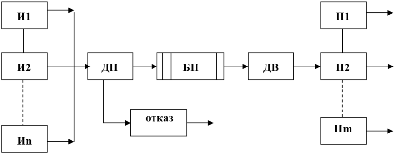

 
 <h1 align="center">CMO </h1>
 

  <b>时序控制系统及自动目标测试</b>
 

 <h1 align="center"></h1>
 

   
  <b><b>Санкт-Петербургский государственный политехнический университет</b> </b>
  <b>Институт компьютерных наук и технологий</b>
  <h1 align="center"></h1>
 

 

## 分析
所有的文件都应该有一根时间线(TimeLine)来贯穿，同时请求(request)应作为事件(event)的最小单位，**CMO 系统中的所有事务都应该是对于请求而言**

**需要一下的功能模块：**
 - 事件（Event）
 - 时间线（TimeLine）同时带有日志功能
 - 请求（Request）
 - 源（Source）
 - 缓冲区（Buffer）
 - 处理机（Device）

---

**各模块类型的简要概述：**

原文：
 - ИБ - бесконечный (источники)
 - ИЗ2 - равномерный (законы распределения)
 - ПЗ1 – экспоненциальный (законы распределения времени прибор)
 - Д10З3 - на свободное место (записи в буфер, если есть место)
 - Д10О5 – вновь пришедшая (дисциплины отказа)
 - Д2П1 - приоритет по номеру прибора (выбор прибора)
 - Д2Б4 - приоритет по номеру источника, по одной заявке (выбор заявки из буфера)
 - ОД1 - календарь событий, буфер и текущее состояние (отображение динамики функционирования модели)
 - ОР1 - сводная таблица результатов (отображение результатов)

---

中文：
 - ИБ：源的类型为无限源（一直生成请求）
 - ИЗ2：每个源生成请求的间隔为**等长**的
 - ПЗ1：对于每个处理机处理请求的时长为**负指数增长**
 - Д10З3：对于请求插入缓冲区的规则为，按照顺序选择缓冲区,插入空闲的缓冲区。不存在转移队列
 - Д10О5：如果没有空闲的处理机及缓冲区，请求应直接离开系统，并且不得改变缓冲区的任何状态
 - Д2П1：处理机的优先级和源的优先级都由其编号决定，选择**优先级最大的处理机**进行处理请求
 - Д2Б4：从缓冲区中选择请求的规则为，选择**优先级最高**的请求（请求的优先级就是源的编号），如果缓冲区中有多个同优先级的请求，优先选择最后进入缓冲区的
 - ОД1：手动测试模式，输出日志、缓冲区及当前的事件
 - ОР1：自动测试模式，输出测试结果

---

## 架构

## 模拟时序图

## 程序框图

## 文件职责

### 时间线（TimeLine）
时间线应该作为穿插各功能模块的线，带有日志功能以方便后续的统计及图表生成

**开发说明：**
 - 使用单例模式，每次程序运行应该只有一条时间线
 - 从 0 开始计时（计数），每次增加一个时间单位。每单位的时间是多长应在初始化时进行确定
 - 程序运行后应通过时间线中的时间对 buffer/device/source 进行判断，看里面是否记录有需要执行的任务
 - 包含一个日志，记录发生了的时间，并将其写入文件（使用列表存储）

**属性：**
 - 当前时间 **（只允许递增！）**
 - 记录事件的列表（日志）

### 事件（Event）
记录时间，作为时间线（程序）的最小单位

**属性：**
 - 当前时间
 - 事件类型
   - 生成请求
   - 请求进入缓冲区
   - 请求离开缓冲区
   - 请求进入处理机
   - 请求离开处理机
   - 请求被取消
 - 本 CMO 生成的第几个请求
 - 生成这个请求的源ID
 - 请求在他的生成源的ID
 - 缓冲区ID
 - 处理机ID

### 缓冲区（Buffer）
 - _static_ 当前 CMO 中的缓冲区总数
 - 缓冲区 ID
 - 缓冲区优先级
 - 当前在缓冲区中的请求
 - 上一个/当前 请求进入缓冲区的时间
 - 本缓冲区中存留过的请求总数
 - 本缓冲区的服务时间（各请求在缓冲区的停留时间**总和**）
 - 时间线（用户传入）

### 处理机（Device）
 - _static_ 当前 CMO 中的处理机总数
 - 处理机 ID
 - 处理机优先级
 - 当前在处理机中的请求
 - 上一个/当前 请求进入处理机的时间
 - 当前请求处理结束的时间（未来）
 - 本处理机中处理过的请求总数
 - 本处理机的服务时间（各请求在处理机中的停留时间**总和**）
 - 时间线（用户传入）

---

   处理机的处理时间应该为**负指数增长**，即**越往后的请求，处理越快**

​	公式：

​	**$$ 处理时间 = MaxTime \cdot X^{-LAMBDA} $$**

- `MaxTime` - **最大的处理时间**，即第一个请求所需的时间（*$MaxTime > 0$*）
- `X` - 第几个请求（$X > 0, X∈Z $）
- `LAMBDA` - 参数，越接近 1，函数递减的就越快（$0 < LAMBDA < 1$）

---

示例：

+ $$ 处理时间 = 100 \cdot X^{-0.1} $$

  

+ $$ 处理时间 = 100 \cdot X^{-0.2} $$

  

+ $$ 处理时间 = 100 \cdot X^{-0.3} $$

  

+ $$ 处理时间 = 100 \cdot X^{-0.4} $$

  

+ $$ 处理时间 = 100 \cdot X^{-0.5} $$

  
